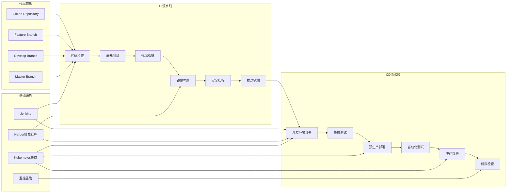
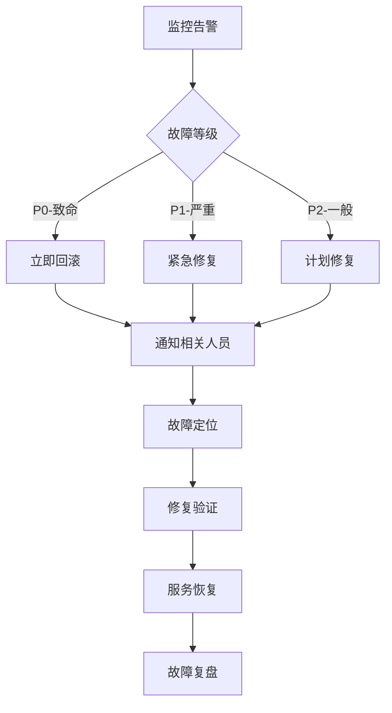

# 饱了么(Baoleme)微服务CI/CD实施方案

## 文档信息

* **项目名称**: 饱了么外卖平台CI/CD流水线

* **文档版本**: v1.0

* **创建日期**: 2024年

* **文档类型**: CI/CD实施方案文档

***

## 1. CI/CD架构设计

### 1.1 整体流水线架构



### 1.2 分支策略

```mermaid
gitgraph
    commit id: "Initial"
    branch develop
    checkout develop
    commit id: "Dev-1"
    
    branch feature/user-service
    checkout feature/user-service
    commit id: "Feature-1"
    commit id: "Feature-2"
    
    checkout develop
    merge feature/user-service
    commit id: "Dev-2"
    
    branch release/v1.0
    checkout release/v1.0
    commit id: "Release-1"
    
    checkout main
    merge release/v1.0
    commit id: "v1.0"
    
    checkout develop
    merge main
    commit id: "Dev-3"
```

### 1.3 环境管理策略

| 环境        | 分支         | 部署方式 | 用途     | 数据     |
| --------- | ---------- | ---- | ------ | ------ |
| **开发环境**  | feature/\* | 自动部署 | 功能开发测试 | 模拟数据   |
| **测试环境**  | develop    | 自动部署 | 集成测试   | 测试数据   |
| **预生产环境** | release/\* | 手动审批 | 生产验证   | 生产数据副本 |
| **生产环境**  | master     | 手动审批 | 正式服务   | 生产数据   |

***

## 2. Jenkins流水线配置

### 2.1 Jenkinsfile模板

#### 微服务通用流水线

```groovy
/**
 * 饱了么微服务CI/CD流水线
 * 支持多服务并行构建和部署
 */
pipeline {
    agent any
    
    parameters {
        choice(
            name: 'SERVICE_NAME',
            choices: ['user-service', 'order-service', 'merchant-service', 'delivery-service', 'marketing-service', 'communication-service'],
            description: '选择要部署的服务'
        )
        choice(
            name: 'DEPLOY_ENV',
            choices: ['dev', 'test', 'staging', 'prod'],
            description: '选择部署环境'
        )
        booleanParam(
            name: 'SKIP_TESTS',
            defaultValue: false,
            description: '是否跳过测试'
        )
        booleanParam(
            name: 'FORCE_DEPLOY',
            defaultValue: false,
            description: '是否强制部署'
        )
    }
    
    environment {
        // 基础配置
        HARBOR_REGISTRY = 'harbor.baoleme.com'
        HARBOR_PROJECT = 'baoleme'
        HARBOR_CREDENTIAL = 'harbor-credential'
        
        // Kubernetes配置
        KUBECONFIG_CREDENTIAL = 'kubeconfig-credential'
        NAMESPACE = "baoleme-${params.DEPLOY_ENV}"
        
        // 应用配置
        APP_NAME = "${params.SERVICE_NAME}"
        IMAGE_TAG = "${env.BUILD_NUMBER}-${env.GIT_COMMIT.take(8)}"
        FULL_IMAGE_NAME = "${HARBOR_REGISTRY}/${HARBOR_PROJECT}/${APP_NAME}:${IMAGE_TAG}"
        
        // 通知配置
        DINGTALK_WEBHOOK = credentials('dingtalk-webhook')
        EMAIL_RECIPIENTS = 'devops@baoleme.com'
    }
    
    stages {
        stage('代码检出') {
            steps {
                script {
                    // 发送开始通知
                    sendNotification('开始', '流水线开始执行', 'info')
                }
                
                checkout scm
                
                script {
                    // 获取提交信息
                    env.GIT_COMMIT_MSG = sh(
                        script: 'git log -1 --pretty=%B',
                        returnStdout: true
                    ).trim()
                    
                    env.GIT_AUTHOR = sh(
                        script: 'git log -1 --pretty=%an',
                        returnStdout: true
                    ).trim()
                }
            }
        }
        
        stage('代码质量检查') {
            parallel {
                stage('代码规范检查') {
                    steps {
                        script {
                            // Maven Checkstyle检查
                            sh """
                                cd ${params.SERVICE_NAME}
                                mvn checkstyle:check -Dcheckstyle.config.location=../checkstyle.xml
                            """
                        }
                    }
                }
                
                stage('安全漏洞扫描') {
                    steps {
                        script {
                            // OWASP依赖检查
                            sh """
                                cd ${params.SERVICE_NAME}
                                mvn org.owasp:dependency-check-maven:check
                            """
                        }
                    }
                }
                
                stage('SonarQube分析') {
                    when {
                        anyOf {
                            branch 'develop'
                            branch 'master'
                        }
                    }
                    steps {
                        withSonarQubeEnv('SonarQube') {
                            sh """
                                cd ${params.SERVICE_NAME}
                                mvn sonar:sonar \
                                    -Dsonar.projectKey=${params.SERVICE_NAME} \
                                    -Dsonar.projectName=${params.SERVICE_NAME} \
                                    -Dsonar.projectVersion=${env.BUILD_NUMBER}
                            """
                        }
                    }
                }
            }
        }
        
        stage('单元测试') {
            when {
                not { params.SKIP_TESTS }
            }
            steps {
                script {
                    sh """
                        cd ${params.SERVICE_NAME}
                        mvn clean test -Dmaven.test.failure.ignore=true
                    """
                }
            }
            post {
                always {
                    // 发布测试报告
                    publishTestResults(
                        testResultsPattern: "${params.SERVICE_NAME}/target/surefire-reports/*.xml"
                    )
                    
                    // 发布覆盖率报告
                    publishCoverage(
                        adapters: [jacocoAdapter(
                            path: "${params.SERVICE_NAME}/target/site/jacoco/jacoco.xml"
                        )],
                        sourceFileResolver: sourceFiles('STORE_LAST_BUILD')
                    )
                }
            }
        }
        
        stage('应用构建') {
            steps {
                script {
                    sh """
                        cd ${params.SERVICE_NAME}
                        mvn clean package -DskipTests=true -Dmaven.javadoc.skip=true
                    """
                }
            }
        }
        
        stage('Docker镜像构建') {
            steps {
                script {
                    // 构建Docker镜像
                    sh """
                        cd ${params.SERVICE_NAME}
                        docker build -t ${FULL_IMAGE_NAME} .
                    """
                    
                    // 镜像安全扫描
                    sh """
                        docker run --rm -v /var/run/docker.sock:/var/run/docker.sock \
                            -v \$HOME/Library/Caches:/root/.cache/ \
                            aquasec/trivy:latest image --exit-code 0 --severity HIGH,CRITICAL \
                            --format table ${FULL_IMAGE_NAME}
                    """
                }
            }
        }
        
        stage('推送镜像') {
            steps {
                script {
                    withCredentials([usernamePassword(
                        credentialsId: env.HARBOR_CREDENTIAL,
                        usernameVariable: 'HARBOR_USER',
                        passwordVariable: 'HARBOR_PASS'
                    )]) {
                        sh """
                            echo \$HARBOR_PASS | docker login ${HARBOR_REGISTRY} -u \$HARBOR_USER --password-stdin
                            docker push ${FULL_IMAGE_NAME}
                            docker logout ${HARBOR_REGISTRY}
                        """
                    }
                }
            }
        }
        
        stage('部署到环境') {
            steps {
                script {
                    // 根据环境选择部署策略
                    switch(params.DEPLOY_ENV) {
                        case 'dev':
                        case 'test':
                            deployToEnvironment(params.DEPLOY_ENV, false)
                            break
                        case 'staging':
                        case 'prod':
                            // 生产环境需要审批
                            timeout(time: 10, unit: 'MINUTES') {
                                input message: "确认部署到${params.DEPLOY_ENV}环境？",
                                      ok: '确认部署',
                                      submitterParameter: 'APPROVER'
                            }
                            deployToEnvironment(params.DEPLOY_ENV, true)
                            break
                    }
                }
            }
        }
        
        stage('健康检查') {
            steps {
                script {
                    // 等待服务启动
                    sleep(time: 30, unit: 'SECONDS')
                    
                    // 健康检查
                    def healthCheckResult = performHealthCheck()
                    
                    if (!healthCheckResult) {
                        error "健康检查失败，部署回滚"
                    }
                }
            }
        }
        
        stage('自动化测试') {
            when {
                anyOf {
                    environment name: 'DEPLOY_ENV', value: 'test'
                    environment name: 'DEPLOY_ENV', value: 'staging'
                }
            }
            parallel {
                stage('接口测试') {
                    steps {
                        script {
                            // 运行Postman接口测试
                            sh """
                                newman run tests/postman/${params.SERVICE_NAME}.postman_collection.json \
                                    --environment tests/postman/${params.DEPLOY_ENV}.postman_environment.json \
                                    --reporters cli,junit \
                                    --reporter-junit-export target/newman-results.xml
                            """
                        }
                    }
                }
                
                stage('性能测试') {
                    when {
                        environment name: 'DEPLOY_ENV', value: 'staging'
                    }
                    steps {
                        script {
                            // JMeter性能测试
                            sh """
                                jmeter -n -t tests/jmeter/${params.SERVICE_NAME}.jmx \
                                    -Jhost=${getServiceHost(params.DEPLOY_ENV)} \
                                    -Jport=80 \
                                    -l target/jmeter-results.jtl \
                                    -e -o target/jmeter-report
                            """
                        }
                    }
                }
            }
        }
    }
    
    post {
        always {
            // 清理工作空间
            script {
                sh "docker rmi ${FULL_IMAGE_NAME} || true"
            }
            
            // 归档构建产物
            archiveArtifacts artifacts: "${params.SERVICE_NAME}/target/*.jar", allowEmptyArchive: true
        }
        
        success {
            script {
                sendNotification('成功', '流水线执行成功', 'success')
            }
        }
        
        failure {
            script {
                sendNotification('失败', '流水线执行失败', 'error')
                
                // 生产环境失败时自动回滚
                if (params.DEPLOY_ENV == 'prod') {
                    rollbackDeployment()
                }
            }
        }
        
        unstable {
            script {
                sendNotification('不稳定', '流水线执行不稳定', 'warning')
            }
        }
    }
}

/**
 * 部署到指定环境
 * @param env 环境名称
 * @param isProduction 是否为生产环境
 */
def deployToEnvironment(String env, boolean isProduction) {
    withCredentials([kubeconfigFile(credentialsId: env.KUBECONFIG_CREDENTIAL, variable: 'KUBECONFIG')]) {
        // 更新部署配置
        sh """
            sed -i 's|{{IMAGE_NAME}}|${FULL_IMAGE_NAME}|g' k8s/${env}/${params.SERVICE_NAME}-deployment.yaml
            sed -i 's|{{BUILD_NUMBER}}|${env.BUILD_NUMBER}|g' k8s/${env}/${params.SERVICE_NAME}-deployment.yaml
        """
        
        if (isProduction) {
            // 生产环境使用蓝绿部署
            blueGreenDeploy(env)
        } else {
            // 非生产环境使用滚动更新
            rollingUpdate(env)
        }
    }
}

/**
 * 蓝绿部署
 * @param env 环境名称
 */
def blueGreenDeploy(String env) {
    script {
        // 获取当前活跃版本
        def currentVersion = sh(
            script: "kubectl get service ${params.SERVICE_NAME} -n ${NAMESPACE} -o jsonpath='{.spec.selector.version}'",
            returnStdout: true
        ).trim()
        
        def newVersion = currentVersion == 'blue' ? 'green' : 'blue'
        
        echo "当前版本: ${currentVersion}, 新版本: ${newVersion}"
        
        // 部署新版本
        sh """
            sed -i 's|version: .*|version: ${newVersion}|g' k8s/${env}/${params.SERVICE_NAME}-deployment.yaml
            kubectl apply -f k8s/${env}/${params.SERVICE_NAME}-deployment.yaml -n ${NAMESPACE}
        """
        
        // 等待新版本就绪
        sh """
            kubectl rollout status deployment/${params.SERVICE_NAME}-${newVersion} -n ${NAMESPACE} --timeout=300s
        """
        
        // 切换流量到新版本
        sh """
            kubectl patch service ${params.SERVICE_NAME} -n ${NAMESPACE} -p '{"spec":{"selector":{"version":"${newVersion}"}}}'
        """
        
        // 验证新版本
        sleep(time: 30, unit: 'SECONDS')
        def healthCheck = performHealthCheck()
        
        if (healthCheck) {
            // 删除旧版本
            sh """
                kubectl delete deployment ${params.SERVICE_NAME}-${currentVersion} -n ${NAMESPACE} || true
            """
            echo "蓝绿部署成功，已切换到${newVersion}版本"
        } else {
            // 回滚到旧版本
            sh """
                kubectl patch service ${params.SERVICE_NAME} -n ${NAMESPACE} -p '{"spec":{"selector":{"version":"${currentVersion}"}}}'
                kubectl delete deployment ${params.SERVICE_NAME}-${newVersion} -n ${NAMESPACE}
            """
            error "新版本健康检查失败，已回滚到${currentVersion}版本"
        }
    }
}

/**
 * 滚动更新部署
 * @param env 环境名称
 */
def rollingUpdate(String env) {
    sh """
        kubectl apply -f k8s/${env}/${params.SERVICE_NAME}-deployment.yaml -n ${NAMESPACE}
        kubectl rollout status deployment/${params.SERVICE_NAME} -n ${NAMESPACE} --timeout=300s
    """
}

/**
 * 执行健康检查
 * @return 健康检查结果
 */
def performHealthCheck() {
    script {
        def serviceHost = getServiceHost(params.DEPLOY_ENV)
        def maxRetries = 10
        def retryCount = 0
        
        while (retryCount < maxRetries) {
            try {
                def response = sh(
                    script: "curl -s -o /dev/null -w '%{http_code}' http://${serviceHost}/actuator/health",
                    returnStdout: true
                ).trim()
                
                if (response == '200') {
                    echo "健康检查成功，HTTP状态码: ${response}"
                    return true
                }
                
                echo "健康检查失败，HTTP状态码: ${response}，重试中..."
                sleep(time: 10, unit: 'SECONDS')
                retryCount++
                
            } catch (Exception e) {
                echo "健康检查异常: ${e.getMessage()}，重试中..."
                sleep(time: 10, unit: 'SECONDS')
                retryCount++
            }
        }
        
        echo "健康检查失败，已达到最大重试次数"
        return false
    }
}

/**
 * 获取服务访问地址
 * @param env 环境名称
 * @return 服务地址
 */
def getServiceHost(String env) {
    switch(env) {
        case 'dev':
            return "${params.SERVICE_NAME}-dev.baoleme.com"
        case 'test':
            return "${params.SERVICE_NAME}-test.baoleme.com"
        case 'staging':
            return "${params.SERVICE_NAME}-staging.baoleme.com"
        case 'prod':
            return "${params.SERVICE_NAME}.baoleme.com"
        default:
            return "localhost:8080"
    }
}

/**
 * 发送通知
 * @param status 状态
 * @param message 消息内容
 * @param level 级别
 */
def sendNotification(String status, String message, String level) {
    script {
        def color = level == 'success' ? 'good' : (level == 'error' ? 'danger' : 'warning')
        def emoji = level == 'success' ? '✅' : (level == 'error' ? '❌' : '⚠️')
        
        // 钉钉通知
        def dingTalkMessage = [
            msgtype: 'markdown',
            markdown: [
                title: "${emoji} 饱了么CI/CD通知",
                text: """
                    ## ${emoji} 饱了么CI/CD通知
                    
                    **状态**: ${status}
                    **服务**: ${params.SERVICE_NAME}
                    **环境**: ${params.DEPLOY_ENV}
                    **分支**: ${env.BRANCH_NAME}
                    **构建号**: ${env.BUILD_NUMBER}
                    **提交者**: ${env.GIT_AUTHOR}
                    **提交信息**: ${env.GIT_COMMIT_MSG}
                    **消息**: ${message}
                    
                    [查看详情](${env.BUILD_URL})
                """.stripIndent()
            ]
        ]
        
        httpRequest(
            httpMode: 'POST',
            url: env.DINGTALK_WEBHOOK,
            contentType: 'APPLICATION_JSON',
            requestBody: groovy.json.JsonOutput.toJson(dingTalkMessage)
        )
        
        // 邮件通知（仅失败时发送）
        if (level == 'error') {
            emailext(
                subject: "[饱了么CI/CD] ${params.SERVICE_NAME} 部署失败",
                body: """
                    <h2>部署失败通知</h2>
                    <p><strong>服务</strong>: ${params.SERVICE_NAME}</p>
                    <p><strong>环境</strong>: ${params.DEPLOY_ENV}</p>
                    <p><strong>分支</strong>: ${env.BRANCH_NAME}</p>
                    <p><strong>构建号</strong>: ${env.BUILD_NUMBER}</p>
                    <p><strong>提交者</strong>: ${env.GIT_AUTHOR}</p>
                    <p><strong>提交信息</strong>: ${env.GIT_COMMIT_MSG}</p>
                    <p><strong>错误信息</strong>: ${message}</p>
                    <p><a href="${env.BUILD_URL}">查看构建详情</a></p>
                """,
                to: env.EMAIL_RECIPIENTS,
                mimeType: 'text/html'
            )
        }
    }
}

/**
 * 回滚部署
 */
def rollbackDeployment() {
    script {
        echo "开始自动回滚..."
        
        withCredentials([kubeconfigFile(credentialsId: env.KUBECONFIG_CREDENTIAL, variable: 'KUBECONFIG')]) {
            // 回滚到上一个版本
            sh """
                kubectl rollout undo deployment/${params.SERVICE_NAME} -n ${NAMESPACE}
                kubectl rollout status deployment/${params.SERVICE_NAME} -n ${NAMESPACE} --timeout=300s
            """
        }
        
        // 验证回滚结果
        def rollbackHealthCheck = performHealthCheck()
        
        if (rollbackHealthCheck) {
            sendNotification('回滚成功', '自动回滚完成，服务已恢复正常', 'success')
        } else {
            sendNotification('回滚失败', '自动回滚失败，需要人工介入', 'error')
        }
    }
}
```

### 2.2 多服务并行构建流水线

```groovy
/**
 * 多服务并行构建流水线
 * 用于批量构建和部署多个微服务
 */
pipeline {
    agent any
    
    parameters {
        checkboxParameter(
            name: 'SERVICES',
            choices: [
                'user-service',
                'order-service', 
                'merchant-service',
                'delivery-service',
                'marketing-service',
                'communication-service'
            ],
            description: '选择要构建的服务（可多选）'
        )
        choice(
            name: 'DEPLOY_ENV',
            choices: ['dev', 'test', 'staging', 'prod'],
            description: '选择部署环境'
        )
    }
    
    stages {
        stage('并行构建服务') {
            steps {
                script {
                    def selectedServices = params.SERVICES.split(',')
                    def parallelBuilds = [:]
                    
                    selectedServices.each { service ->
                        parallelBuilds[service] = {
                            build job: 'baoleme-microservice-pipeline',
                                  parameters: [
                                      string(name: 'SERVICE_NAME', value: service),
                                      string(name: 'DEPLOY_ENV', value: params.DEPLOY_ENV)
                                  ],
                                  wait: true,
                                  propagate: true
                        }
                    }
                    
                    parallel parallelBuilds
                }
            }
        }
        
        stage('集成测试') {
            when {
                anyOf {
                    environment name: 'DEPLOY_ENV', value: 'test'
                    environment name: 'DEPLOY_ENV', value: 'staging'
                }
            }
            steps {
                script {
                    // 运行端到端测试
                    sh """
                        cd tests/e2e
                        npm install
                        npm run test:${params.DEPLOY_ENV}
                    """
                }
            }
        }
    }
}
```

***

## 3. GitLab CI配置

### 3.1 .gitlab-ci.yml配置

```yaml
# GitLab CI/CD配置文件
# 支持多服务自动化构建和部署

stages:
  - validate
  - build
  - test
  - security
  - package
  - deploy-dev
  - deploy-test
  - deploy-staging
  - deploy-prod

variables:
  # Docker配置
  DOCKER_DRIVER: overlay2
  DOCKER_TLS_CERTDIR: "/certs"
  
  # Harbor配置
  HARBOR_REGISTRY: "harbor.baoleme.com"
  HARBOR_PROJECT: "baoleme"
  
  # Kubernetes配置
  KUBECTL_VERSION: "1.28.0"
  HELM_VERSION: "3.12.0"
  
  # Maven配置
  MAVEN_OPTS: "-Dmaven.repo.local=$CI_PROJECT_DIR/.m2/repository"
  MAVEN_CLI_OPTS: "--batch-mode --errors --fail-at-end --show-version"

# 缓存配置
cache:
  paths:
    - .m2/repository/
    - node_modules/
    - target/

# 代码验证阶段
validate:code-format:
  stage: validate
  image: maven:3.9-openjdk-17
  script:
    - mvn $MAVEN_CLI_OPTS validate
    - mvn $MAVEN_CLI_OPTS checkstyle:check
  rules:
    - if: $CI_PIPELINE_SOURCE == "merge_request_event"
    - if: $CI_COMMIT_BRANCH == "develop"
    - if: $CI_COMMIT_BRANCH == "master"

validate:dependency-check:
  stage: validate
  image: maven:3.9-openjdk-17
  script:
    - mvn $MAVEN_CLI_OPTS org.owasp:dependency-check-maven:check
  artifacts:
    reports:
      dependency_scanning: "target/dependency-check-report.json"
    expire_in: 1 week
  rules:
    - if: $CI_COMMIT_BRANCH == "develop"
    - if: $CI_COMMIT_BRANCH == "master"

# 构建阶段
.build-template: &build-template
  stage: build
  image: maven:3.9-openjdk-17
  script:
    - cd $SERVICE_NAME
    - mvn $MAVEN_CLI_OPTS clean compile
  artifacts:
    paths:
      - $SERVICE_NAME/target/
    expire_in: 1 hour

build:user-service:
  <<: *build-template
  variables:
    SERVICE_NAME: "user-service"
  rules:
    - changes:
        - user-service/**/*
        - pom.xml
    - if: $CI_COMMIT_BRANCH == "develop"
    - if: $CI_COMMIT_BRANCH == "master"

build:order-service:
  <<: *build-template
  variables:
    SERVICE_NAME: "order-service"
  rules:
    - changes:
        - order-service/**/*
        - pom.xml
    - if: $CI_COMMIT_BRANCH == "develop"
    - if: $CI_COMMIT_BRANCH == "master"

build:merchant-service:
  <<: *build-template
  variables:
    SERVICE_NAME: "merchant-service"
  rules:
    - changes:
        - merchant-service/**/*
        - pom.xml
    - if: $CI_COMMIT_BRANCH == "develop"
    - if: $CI_COMMIT_BRANCH == "master"

# 测试阶段
.test-template: &test-template
  stage: test
  image: maven:3.9-openjdk-17
  services:
    - name: mysql:8.0
      alias: mysql
      variables:
        MYSQL_ROOT_PASSWORD: "test123"
        MYSQL_DATABASE: "baoleme_test"
    - name: redis:7.0-alpine
      alias: redis
  variables:
    SPRING_PROFILES_ACTIVE: "test"
    SPRING_DATASOURCE_URL: "jdbc:mysql://mysql:3306/baoleme_test"
    SPRING_DATASOURCE_USERNAME: "root"
    SPRING_DATASOURCE_PASSWORD: "test123"
    SPRING_REDIS_HOST: "redis"
  script:
    - cd $SERVICE_NAME
    - mvn $MAVEN_CLI_OPTS test
  artifacts:
    reports:
      junit:
        - $SERVICE_NAME/target/surefire-reports/TEST-*.xml
      coverage_report:
        coverage_format: jacoco
        path: $SERVICE_NAME/target/site/jacoco/jacoco.xml
    paths:
      - $SERVICE_NAME/target/surefire-reports/
      - $SERVICE_NAME/target/site/jacoco/
    expire_in: 1 week
  coverage: '/Total.*?([0-9]{1,3})%/'

test:user-service:
  <<: *test-template
  variables:
    SERVICE_NAME: "user-service"
  needs: ["build:user-service"]
  rules:
    - changes:
        - user-service/**/*
        - pom.xml
    - if: $CI_COMMIT_BRANCH == "develop"
    - if: $CI_COMMIT_BRANCH == "master"

test:order-service:
  <<: *test-template
  variables:
    SERVICE_NAME: "order-service"
  needs: ["build:order-service"]
  rules:
    - changes:
        - order-service/**/*
        - pom.xml
    - if: $CI_COMMIT_BRANCH == "develop"
    - if: $CI_COMMIT_BRANCH == "master"

# 安全扫描阶段
security:container-scan:
  stage: security
  image: docker:20.10.16
  services:
    - docker:20.10.16-dind
  variables:
    DOCKER_HOST: tcp://docker:2376
    DOCKER_TLS_CERTDIR: "/certs"
    DOCKER_TLS_VERIFY: 1
    DOCKER_CERT_PATH: "$DOCKER_TLS_CERTDIR/client"
  before_script:
    - docker info
    - apk add --no-cache curl
    - |
      curl -sfL https://raw.githubusercontent.com/aquasecurity/trivy/main/contrib/install.sh | sh -s -- -b /usr/local/bin
  script:
    - |
      for service in user-service order-service merchant-service; do
        if [ -f "$service/Dockerfile" ]; then
          echo "扫描 $service 镜像安全漏洞..."
          docker build -t $service:$CI_COMMIT_SHA $service/
          trivy image --exit-code 0 --severity HIGH,CRITICAL --format table $service:$CI_COMMIT_SHA
        fi
      done
  rules:
    - if: $CI_COMMIT_BRANCH == "develop"
    - if: $CI_COMMIT_BRANCH == "master"

# 打包阶段
.package-template: &package-template
  stage: package
  image: docker:20.10.16
  services:
    - docker:20.10.16-dind
  variables:
    DOCKER_HOST: tcp://docker:2376
    DOCKER_TLS_CERTDIR: "/certs"
    DOCKER_TLS_VERIFY: 1
    DOCKER_CERT_PATH: "$DOCKER_TLS_CERTDIR/client"
  before_script:
    - docker info
    - echo $HARBOR_PASSWORD | docker login $HARBOR_REGISTRY -u $HARBOR_USERNAME --password-stdin
  script:
    - |
      IMAGE_TAG="${CI_COMMIT_SHA:0:8}-${CI_PIPELINE_ID}"
      FULL_IMAGE_NAME="$HARBOR_REGISTRY/$HARBOR_PROJECT/$SERVICE_NAME:$IMAGE_TAG"
      
      echo "构建镜像: $FULL_IMAGE_NAME"
      docker build -t $FULL_IMAGE_NAME $SERVICE_NAME/
      
      echo "推送镜像: $FULL_IMAGE_NAME"
      docker push $FULL_IMAGE_NAME
      
      # 如果是master分支，同时打latest标签
      if [ "$CI_COMMIT_BRANCH" = "master" ]; then
        LATEST_IMAGE_NAME="$HARBOR_REGISTRY/$HARBOR_PROJECT/$SERVICE_NAME:latest"
        docker tag $FULL_IMAGE_NAME $LATEST_IMAGE_NAME
        docker push $LATEST_IMAGE_NAME
      fi
      
      echo "IMAGE_TAG=$IMAGE_TAG" > build.env
      echo "FULL_IMAGE_NAME=$FULL_IMAGE_NAME" >> build.env
  artifacts:
    reports:
      dotenv: build.env
    expire_in: 1 hour
  after_script:
    - docker logout $HARBOR_REGISTRY

package:user-service:
  <<: *package-template
  variables:
    SERVICE_NAME: "user-service"
  needs: ["test:user-service"]
  rules:
    - changes:
        - user-service/**/*
        - pom.xml
    - if: $CI_COMMIT_BRANCH == "develop"
    - if: $CI_COMMIT_BRANCH == "master"

package:order-service:
  <<: *package-template
  variables:
    SERVICE_NAME: "order-service"
  needs: ["test:order-service"]
  rules:
    - changes:
        - order-service/**/*
        - pom.xml
    - if: $CI_COMMIT_BRANCH == "develop"
    - if: $CI_COMMIT_BRANCH == "master"

# 部署模板
.deploy-template: &deploy-template
  image: 
    name: bitnami/kubectl:$KUBECTL_VERSION
    entrypoint: [""]
  before_script:
    - kubectl version --client
    - kubectl config use-context $KUBE_CONTEXT
  script:
    - |
      # 更新部署配置
      sed -i "s|{{IMAGE_NAME}}|$FULL_IMAGE_NAME|g" k8s/$DEPLOY_ENV/$SERVICE_NAME-deployment.yaml
      sed -i "s|{{BUILD_NUMBER}}|$CI_PIPELINE_ID|g" k8s/$DEPLOY_ENV/$SERVICE_NAME-deployment.yaml
      
      # 应用配置
      kubectl apply -f k8s/$DEPLOY_ENV/$SERVICE_NAME-deployment.yaml -n baoleme-$DEPLOY_ENV
      kubectl apply -f k8s/$DEPLOY_ENV/$SERVICE_NAME-service.yaml -n baoleme-$DEPLOY_ENV
      
      # 等待部署完成
      kubectl rollout status deployment/$SERVICE_NAME -n baoleme-$DEPLOY_ENV --timeout=300s
      
      # 健康检查
      sleep 30
      kubectl get pods -n baoleme-$DEPLOY_ENV -l app=$SERVICE_NAME

# 开发环境部署
deploy:dev:user-service:
  <<: *deploy-template
  stage: deploy-dev
  variables:
    SERVICE_NAME: "user-service"
    DEPLOY_ENV: "dev"
    KUBE_CONTEXT: "dev-cluster"
  environment:
    name: dev
    url: https://user-service-dev.baoleme.com
  needs: ["package:user-service"]
  rules:
    - if: $CI_COMMIT_BRANCH == "develop"
      changes:
        - user-service/**/*
        - k8s/dev/**/*

# 测试环境部署
deploy:test:user-service:
  <<: *deploy-template
  stage: deploy-test
  variables:
    SERVICE_NAME: "user-service"
    DEPLOY_ENV: "test"
    KUBE_CONTEXT: "test-cluster"
  environment:
    name: test
    url: https://user-service-test.baoleme.com
  needs: ["package:user-service"]
  rules:
    - if: $CI_COMMIT_BRANCH == "develop"
      changes:
        - user-service/**/*
        - k8s/test/**/*
      when: manual

# 预生产环境部署
deploy:staging:user-service:
  <<: *deploy-template
  stage: deploy-staging
  variables:
    SERVICE_NAME: "user-service"
    DEPLOY_ENV: "staging"
    KUBE_CONTEXT: "staging-cluster"
  environment:
    name: staging
    url: https://user-service-staging.baoleme.com
  needs: ["package:user-service"]
  rules:
    - if: $CI_COMMIT_BRANCH == "master"
      changes:
        - user-service/**/*
        - k8s/staging/**/*
      when: manual

# 生产环境部署
deploy:prod:user-service:
  <<: *deploy-template
  stage: deploy-prod
  variables:
    SERVICE_NAME: "user-service"
    DEPLOY_ENV: "prod"
    KUBE_CONTEXT: "prod-cluster"
  environment:
    name: production
    url: https://user-service.baoleme.com
  needs: ["package:user-service"]
  rules:
    - if: $CI_COMMIT_BRANCH == "master"
      changes:
        - user-service/**/*
        - k8s/prod/**/*
      when: manual
  before_script:
    - kubectl version --client
    - kubectl config use-context $KUBE_CONTEXT
    # 生产环境额外的安全检查
    - |
      echo "生产环境部署前检查..."
      # 检查镜像是否通过安全扫描
      # 检查配置是否正确
      # 检查依赖服务状态
```

***

## 4. Docker配置

### 4.1 多阶段构建Dockerfile

#### 通用微服务Dockerfile

```dockerfile
# 饱了么微服务多阶段构建Dockerfile
# 优化镜像大小和构建效率

# 构建阶段
FROM maven:3.9-openjdk-17-slim AS builder

# 设置工作目录
WORKDIR /app

# 复制pom文件，利用Docker缓存
COPY pom.xml .
COPY ../pom.xml ../pom.xml

# 下载依赖（利用缓存层）
RUN mvn dependency:go-offline -B

# 复制源代码
COPY src ./src

# 构建应用
RUN mvn clean package -DskipTests -B

# 运行阶段
FROM openjdk:17-jre-slim

# 创建应用用户（安全最佳实践）
RUN groupadd -r appuser && useradd -r -g appuser appuser

# 安装必要的工具
RUN apt-get update && apt-get install -y \
    curl \
    dumb-init \
    && rm -rf /var/lib/apt/lists/*

# 设置工作目录
WORKDIR /app

# 从构建阶段复制jar文件
COPY --from=builder /app/target/*.jar app.jar

# 创建日志目录
RUN mkdir -p /app/logs && chown -R appuser:appuser /app

# 切换到非root用户
USER appuser

# 健康检查
HEALTHCHECK --interval=30s --timeout=10s --start-period=60s --retries=3 \
    CMD curl -f http://localhost:8080/actuator/health || exit 1

# 暴露端口
EXPOSE 8080

# JVM参数优化
ENV JAVA_OPTS="-Xms512m -Xmx1024m -XX:+UseG1GC -XX:+UseContainerSupport -XX:MaxRAMPercentage=75.0"

# 启动应用
ENTRYPOINT ["dumb-init", "--"]
CMD ["sh", "-c", "java $JAVA_OPTS -jar app.jar"]
```

#### 前端应用Dockerfile

```dockerfile
# 前端应用多阶段构建
# React应用构建和Nginx部署

# 构建阶段
FROM node:18-alpine AS builder

WORKDIR /app

# 复制package文件
COPY package*.json ./

# 安装依赖
RUN npm ci --only=production

# 复制源代码
COPY . .

# 构建应用
RUN npm run build

# 生产阶段
FROM nginx:1.25-alpine

# 复制自定义nginx配置
COPY nginx.conf /etc/nginx/nginx.conf

# 复制构建产物
COPY --from=builder /app/dist /usr/share/nginx/html

# 创建nginx用户
RUN addgroup -g 1001 -S nginx && \
    adduser -S -D -H -u 1001 -h /var/cache/nginx -s /sbin/nologin -G nginx -g nginx nginx

# 健康检查
HEALTHCHECK --interval=30s --timeout=10s --start-period=30s --retries=3 \
    CMD curl -f http://localhost:80/health || exit 1

EXPOSE 80

CMD ["nginx", "-g", "daemon off;"]
```

### 4.2 Docker Compose开发环境

```yaml
# docker-compose.yml
# 本地开发环境一键启动

version: '3.8'

services:
  # MySQL数据库
  mysql:
    image: mysql:8.0
    container_name: baoleme-mysql
    environment:
      MYSQL_ROOT_PASSWORD: root123
      MYSQL_DATABASE: baoleme
      MYSQL_USER: baoleme
      MYSQL_PASSWORD: baoleme123
    ports:
      - "3306:3306"
    volumes:
      - mysql_data:/var/lib/mysql
      - ./sql/init.sql:/docker-entrypoint-initdb.d/init.sql
    networks:
      - baoleme-network
    healthcheck:
      test: ["CMD", "mysqladmin", "ping", "-h", "localhost"]
      timeout: 20s
      retries: 10

  # Redis缓存
  redis:
    image: redis:7.0-alpine
    container_name: baoleme-redis
    ports:
      - "6379:6379"
    volumes:
      - redis_data:/data
      - ./redis/redis.conf:/usr/local/etc/redis/redis.conf
    command: redis-server /usr/local/etc/redis/redis.conf
    networks:
      - baoleme-network
    healthcheck:
      test: ["CMD", "redis-cli", "ping"]
      interval: 30s
      timeout: 10s
      retries: 3

  # RabbitMQ消息队列
  rabbitmq:
    image: rabbitmq:3.12-management-alpine
    container_name: baoleme-rabbitmq
    environment:
      RABBITMQ_DEFAULT_USER: baoleme
      RABBITMQ_DEFAULT_PASS: baoleme123
    ports:
      - "5672:5672"
      - "15672:15672"
    volumes:
      - rabbitmq_data:/var/lib/rabbitmq
    networks:
      - baoleme-network
    healthcheck:
      test: rabbitmq-diagnostics -q ping
      interval: 30s
      timeout: 30s
      retries: 3

  # Nacos注册中心
  nacos:
    image: nacos/nacos-server:v2.2.3
    container_name: baoleme-nacos
    environment:
      MODE: standalone
      SPRING_DATASOURCE_PLATFORM: mysql
      MYSQL_SERVICE_HOST: mysql
      MYSQL_SERVICE_DB_NAME: nacos
      MYSQL_SERVICE_USER: root
      MYSQL_SERVICE_PASSWORD: root123
      MYSQL_SERVICE_DB_PARAM: characterEncoding=utf8&connectTimeout=1000&socketTimeout=3000&autoReconnect=true&useSSL=false&serverTimezone=Asia/Shanghai
    ports:
      - "8848:8848"
      - "9848:9848"
    volumes:
      - nacos_data:/home/nacos/data
    networks:
      - baoleme-network
    depends_on:
      mysql:
        condition: service_healthy
    healthcheck:
      test: ["CMD", "curl", "-f", "http://localhost:8848/nacos/v1/ns/operator/servers"]
      interval: 30s
      timeout: 10s
      retries: 3

  # 用户服务
  user-service:
    build:
      context: ./user-service
      dockerfile: Dockerfile
    container_name: baoleme-user-service
    environment:
      SPRING_PROFILES_ACTIVE: docker
      NACOS_SERVER_ADDR: nacos:8848
      MYSQL_HOST: mysql
      REDIS_HOST: redis
      RABBITMQ_HOST: rabbitmq
    ports:
      - "8081:8080"
    networks:
      - baoleme-network
    depends_on:
      mysql:
        condition: service_healthy
      redis:
        condition: service_healthy
      nacos:
        condition: service_healthy
    healthcheck:
      test: ["CMD", "curl", "-f", "http://localhost:8080/actuator/health"]
      interval: 30s
      timeout: 10s
      retries: 3
      start_period: 60s

  # 订单服务
  order-service:
    build:
      context: ./order-service
      dockerfile: Dockerfile
    container_name: baoleme-order-service
    environment:
      SPRING_PROFILES_ACTIVE: docker
      NACOS_SERVER_ADDR: nacos:8848
      MYSQL_HOST: mysql
      REDIS_HOST: redis
      RABBITMQ_HOST: rabbitmq
    ports:
      - "8082:8080"
    networks:
      - baoleme-network
    depends_on:
      mysql:
        condition: service_healthy
      redis:
        condition: service_healthy
      nacos:
        condition: service_healthy
      rabbitmq:
        condition: service_healthy
    healthcheck:
      test: ["CMD", "curl", "-f", "http://localhost:8080/actuator/health"]
      interval: 30s
      timeout: 10s
      retries: 3
      start_period: 60s

  # API网关
  gateway:
    build:
      context: ./gateway
      dockerfile: Dockerfile
    container_name: baoleme-gateway
    environment:
      SPRING_PROFILES_ACTIVE: docker
      NACOS_SERVER_ADDR: nacos:8848
      REDIS_HOST: redis
    ports:
      - "8080:8080"
    networks:
      - baoleme-network
    depends_on:
      nacos:
        condition: service_healthy
      user-service:
        condition: service_healthy
      order-service:
        condition: service_healthy
    healthcheck:
      test: ["CMD", "curl", "-f", "http://localhost:8080/actuator/health"]
      interval: 30s
      timeout: 10s
      retries: 3
      start_period: 60s

  # Elasticsearch
  elasticsearch:
    image: elasticsearch:8.9.0
    container_name: baoleme-elasticsearch
    environment:
      - discovery.type=single-node
      - "ES_JAVA_OPTS=-Xms512m -Xmx512m"
      - xpack.security.enabled=false
    ports:
      - "9200:9200"
    volumes:
      - elasticsearch_data:/usr/share/elasticsearch/data
    networks:
      - baoleme-network
    healthcheck:
      test: ["CMD", "curl", "-f", "http://localhost:9200/_cluster/health"]
      interval: 30s
      timeout: 10s
      retries: 3

  # Kibana
  kibana:
    image: kibana:8.9.0
    container_name: baoleme-kibana
    environment:
      ELASTICSEARCH_HOSTS: http://elasticsearch:9200
    ports:
      - "5601:5601"
    networks:
      - baoleme-network
    depends_on:
      elasticsearch:
        condition: service_healthy

  # Prometheus监控
  prometheus:
    image: prom/prometheus:v2.45.0
    container_name: baoleme-prometheus
    ports:
      - "9090:9090"
    volumes:
      - ./monitoring/prometheus.yml:/etc/prometheus/prometheus.yml
      - prometheus_data:/prometheus
    command:
      - '--config.file=/etc/prometheus/prometheus.yml'
      - '--storage.tsdb.path=/prometheus'
      - '--web.console.libraries=/etc/prometheus/console_libraries'
      - '--web.console.templates=/etc/prometheus/consoles'
      - '--storage.tsdb.retention.time=200h'
      - '--web.enable-lifecycle'
    networks:
      - baoleme-network

  # Grafana可视化
  grafana:
    image: grafana/grafana:10.0.0
    container_name: baoleme-grafana
    environment:
      GF_SECURITY_ADMIN_PASSWORD: admin123
    ports:
      - "3000:3000"
    volumes:
      - grafana_data:/var/lib/grafana
      - ./monitoring/grafana/dashboards:/etc/grafana/provisioning/dashboards
      - ./monitoring/grafana/datasources:/etc/grafana/provisioning/datasources
    networks:
      - baoleme-network
    depends_on:
      - prometheus

volumes:
  mysql_data:
  redis_data:
  rabbitmq_data:
  nacos_data:
  elasticsearch_data:
  prometheus_data:
  grafana_data:

networks:
  baoleme-network:
    driver: bridge
```

### 4.3 开发环境启动脚本

```bash
#!/bin/bash
# dev-start.sh
# 开发环境一键启动脚本

set -e

echo "🚀 启动饱了么开发环境..."

# 检查Docker是否运行
if ! docker info > /dev/null 2>&1; then
    echo "❌ Docker未运行，请先启动Docker"
    exit 1
fi

# 检查Docker Compose是否安装
if ! command -v docker-compose &> /dev/null; then
    echo "❌ Docker Compose未安装"
    exit 1
fi

# 创建网络（如果不存在）
docker network create baoleme-network 2>/dev/null || true

# 启动基础设施服务
echo "📦 启动基础设施服务..."
docker-compose up -d mysql redis rabbitmq nacos elasticsearch

# 等待基础服务启动
echo "⏳ 等待基础服务启动完成..."
sleep 30

# 检查基础服务健康状态
echo "🔍 检查基础服务状态..."
services=("mysql" "redis" "rabbitmq" "nacos" "elasticsearch")
for service in "${services[@]}"; do
    echo "检查 $service..."
    timeout=60
    while [ $timeout -gt 0 ]; do
        if docker-compose ps $service | grep -q "healthy\|Up"; then
            echo "✅ $service 已就绪"
            break
        fi
        sleep 2
        timeout=$((timeout-2))
    done
    
    if [ $timeout -le 0 ]; then
        echo "❌ $service 启动超时"
        docker-compose logs $service
        exit 1
    fi
done

# 启动微服务
echo "🎯 启动微服务..."
docker-compose up -d user-service order-service gateway

# 等待微服务启动
echo "⏳ 等待微服务启动完成..."
sleep 45

# 检查微服务健康状态
echo "🔍 检查微服务状态..."
microservices=("user-service" "order-service" "gateway")
for service in "${microservices[@]}"; do
    echo "检查 $service..."
    timeout=60
    while [ $timeout -gt 0 ]; do
        if docker-compose ps $service | grep -q "healthy\|Up"; then
            echo "✅ $service 已就绪"
            break
        fi
        sleep 2
        timeout=$((timeout-2))
    done
    
    if [ $timeout -le 0 ]; then
        echo "❌ $service 启动超时"
        docker-compose logs $service
        exit 1
    fi
done

# 启动监控服务
echo "📊 启动监控服务..."
docker-compose up -d prometheus grafana kibana

echo "🎉 开发环境启动完成！"
echo ""
echo "📋 服务访问地址："
echo "  🌐 API网关:        http://localhost:8080"
echo "  👤 用户服务:       http://localhost:8081"
echo "  📦 订单服务:       http://localhost:8082"
echo "  🗄️  Nacos控制台:    http://localhost:8848/nacos (nacos/nacos)"
echo "  🐰 RabbitMQ管理:   http://localhost:15672 (baoleme/baoleme123)"
echo "  📊 Prometheus:     http://localhost:9090"
echo "  📈 Grafana:        http://localhost:3000 (admin/admin123)"
echo "  🔍 Kibana:         http://localhost:5601"
echo "  🔍 Elasticsearch:  http://localhost:9200"
echo ""
echo "💡 使用说明："
echo "  - 停止环境: docker-compose down"
echo "  - 查看日志: docker-compose logs -f [service-name]"
echo "  - 重启服务: docker-compose restart [service-name]"
echo "  - 清理数据: docker-compose down -v"
```

---

## 5. Kubernetes部署配置

### 5.1 Helm Chart结构
```
helm/
├── baoleme/
│   ├── Chart.yaml
│   ├── values.yaml
│   ├── values-dev.yaml
│   ├── values-test.yaml
│   ├── values-staging.yaml
│   ├── values-prod.yaml
│   └── templates/
│       ├── deployment.yaml
│       ├── service.yaml
│       ├── ingress.yaml
│       ├── configmap.yaml
│       ├── secret.yaml
│       ├── hpa.yaml
│       └── servicemonitor.yaml
└── infrastructure/
    ├── mysql/
    ├── redis/
    ├── nacos/
    └── monitoring/
```

### 5.2 Chart.yaml
```yaml
# Chart.yaml
apiVersion: v2
name: baoleme
description: 饱了么外卖平台微服务Helm Chart
type: application
version: 1.0.0
appVersion: "1.0.0"
keywords:
  - microservice
  - food-delivery
  - spring-boot
home: https://github.com/baoleme/baoleme
sources:
  - https://github.com/baoleme/baoleme
maintainers:
  - name: DevOps Team
    email: devops@baoleme.com
dependencies:
  - name: mysql
    version: 9.4.6
    repository: https://charts.bitnami.com/bitnami
    condition: mysql.enabled
  - name: redis
    version: 17.3.7
    repository: https://charts.bitnami.com/bitnami
    condition: redis.enabled
```

### 5.3 values.yaml
```yaml
# values.yaml - 默认配置
# 全局配置
global:
  imageRegistry: harbor.baoleme.com
  imageProject: baoleme
  imagePullSecrets:
    - name: harbor-secret
  storageClass: "fast-ssd"

# 服务配置
services:
  userService:
    enabled: true
    name: user-service
    image:
      repository: user-service
      tag: latest
      pullPolicy: Always
    replicas: 2
    resources:
      requests:
        memory: "512Mi"
        cpu: "250m"
      limits:
        memory: "1Gi"
        cpu: "500m"
    env:
      SPRING_PROFILES_ACTIVE: k8s
      JAVA_OPTS: "-Xms512m -Xmx768m"
    service:
      type: ClusterIP
      port: 8080
    ingress:
      enabled: true
      className: nginx
      annotations:
        nginx.ingress.kubernetes.io/rewrite-target: /
        nginx.ingress.kubernetes.io/ssl-redirect: "true"
      hosts:
        - host: user-service.baoleme.com
          paths:
            - path: /
              pathType: Prefix
      tls:
        - secretName: baoleme-tls
          hosts:
            - user-service.baoleme.com
    autoscaling:
      enabled: true
      minReplicas: 2
      maxReplicas: 10
      targetCPUUtilizationPercentage: 70
      targetMemoryUtilizationPercentage: 80
    healthCheck:
      livenessProbe:
        httpGet:
          path: /actuator/health/liveness
          port: 8080
        initialDelaySeconds: 60
        periodSeconds: 30
        timeoutSeconds: 10
        failureThreshold: 3
      readinessProbe:
        httpGet:
          path: /actuator/health/readiness
          port: 8080
        initialDelaySeconds: 30
        periodSeconds: 10
        timeoutSeconds: 5
        failureThreshold: 3

  orderService:
    enabled: true
    name: order-service
    image:
      repository: order-service
      tag: latest
      pullPolicy: Always
    replicas: 3
    resources:
      requests:
        memory: "768Mi"
        cpu: "500m"
      limits:
        memory: "1.5Gi"
        cpu: "1000m"
    env:
      SPRING_PROFILES_ACTIVE: k8s
      JAVA_OPTS: "-Xms768m -Xmx1024m"
    service:
      type: ClusterIP
      port: 8080
    ingress:
      enabled: true
      className: nginx
      hosts:
        - host: order-service.baoleme.com
          paths:
            - path: /
              pathType: Prefix
      tls:
        - secretName: baoleme-tls
          hosts:
            - order-service.baoleme.com
    autoscaling:
      enabled: true
      minReplicas: 3
      maxReplicas: 15
      targetCPUUtilizationPercentage: 70
      targetMemoryUtilizationPercentage: 80

  gateway:
    enabled: true
    name: gateway
    image:
      repository: gateway
      tag: latest
      pullPolicy: Always
    replicas: 2
    resources:
      requests:
        memory: "512Mi"
        cpu: "250m"
      limits:
        memory: "1Gi"
        cpu: "500m"
    service:
      type: LoadBalancer
      port: 80
      targetPort: 8080
    ingress:
      enabled: true
      className: nginx
      annotations:
        nginx.ingress.kubernetes.io/ssl-redirect: "true"
        nginx.ingress.kubernetes.io/use-regex: "true"
        cert-manager.io/cluster-issuer: "letsencrypt-prod"
      hosts:
        - host: api.baoleme.com
          paths:
            - path: /
              pathType: Prefix
      tls:
        - secretName: api-baoleme-tls
          hosts:
            - api.baoleme.com

# 数据库配置
mysql:
  enabled: true
  auth:
    rootPassword: "root123"
    database: "baoleme"
    username: "baoleme"
    password: "baoleme123"
  primary:
    persistence:
      enabled: true
      size: 20Gi
      storageClass: "fast-ssd"
    resources:
      requests:
        memory: "1Gi"
        cpu: "500m"
      limits:
        memory: "2Gi"
        cpu: "1000m"
  metrics:
    enabled: true
    serviceMonitor:
      enabled: true

# Redis配置
redis:
  enabled: true
  auth:
    enabled: true
    password: "redis123"
  master:
    persistence:
      enabled: true
      size: 8Gi
      storageClass: "fast-ssd"
    resources:
      requests:
        memory: "512Mi"
        cpu: "250m"
      limits:
        memory: "1Gi"
        cpu: "500m"
  metrics:
    enabled: true
    serviceMonitor:
      enabled: true

# 配置管理
configMap:
  data:
    application.yml: |
      spring:
        cloud:
          nacos:
            discovery:
              server-addr: nacos:8848
              namespace: ${NACOS_NAMESPACE:public}
            config:
              server-addr: nacos:8848
              namespace: ${NACOS_NAMESPACE:public}
              file-extension: yml
        datasource:
          url: jdbc:mysql://mysql:3306/baoleme?useSSL=false&serverTimezone=Asia/Shanghai
          username: baoleme
          password: baoleme123
        redis:
          host: redis-master
          port: 6379
          password: redis123
        rabbitmq:
          host: rabbitmq
          port: 5672
          username: baoleme
          password: baoleme123
      management:
        endpoints:
          web:
            exposure:
              include: "*"
        endpoint:
          health:
            show-details: always
        metrics:
          export:
            prometheus:
              enabled: true
      logging:
        level:
          com.baoleme: DEBUG
        pattern:
          console: "%d{yyyy-MM-dd HH:mm:ss} [%thread] %-5level %logger{36} - %msg%n"

# 密钥管理
secret:
  data:
    jwt-secret: "YmFvbGVtZS1qd3Qtc2VjcmV0LWtleS0yMDI0"
    mysql-password: "YmFvbGVtZTEyMw=="
    redis-password: "cmVkaXMxMjM="

# 监控配置
monitoring:
  serviceMonitor:
    enabled: true
    interval: 30s
    path: /actuator/prometheus
    labels:
      app: baoleme
  prometheusRule:
    enabled: true
    rules:
      - alert: ServiceDown
        expr: up{job="baoleme"} == 0
        for: 1m
        labels:
          severity: critical
        annotations:
          summary: "Service {{ $labels.instance }} is down"
          description: "Service {{ $labels.instance }} has been down for more than 1 minute."
      - alert: HighCPUUsage
        expr: rate(process_cpu_seconds_total{job="baoleme"}[5m]) * 100 > 80
        for: 5m
        labels:
          severity: warning
        annotations:
          summary: "High CPU usage on {{ $labels.instance }}"
          description: "CPU usage is above 80% for more than 5 minutes."
      - alert: HighMemoryUsage
        expr: (jvm_memory_used_bytes{job="baoleme"} / jvm_memory_max_bytes{job="baoleme"}) * 100 > 85
        for: 5m
        labels:
          severity: warning
        annotations:
          summary: "High memory usage on {{ $labels.instance }}"
          description: "Memory usage is above 85% for more than 5 minutes."
```

### 5.4 Deployment模板
```yaml
# templates/deployment.yaml
apiVersion: apps/v1
kind: Deployment
metadata:
  name: {{ .Values.services.userService.name }}
  namespace: {{ .Release.Namespace }}
  labels:
    app: {{ .Values.services.userService.name }}
    version: {{ .Chart.AppVersion }}
spec:
  replicas: {{ .Values.services.userService.replicas }}
  selector:
    matchLabels:
      app: {{ .Values.services.userService.name }}
  template:
    metadata:
      labels:
        app: {{ .Values.services.userService.name }}
        version: {{ .Chart.AppVersion }}
      annotations:
        prometheus.io/scrape: "true"
        prometheus.io/path: "/actuator/prometheus"
        prometheus.io/port: "8080"
    spec:
      imagePullSecrets:
        {{- range .Values.global.imagePullSecrets }}
        - name: {{ .name }}
        {{- end }}
      containers:
      - name: {{ .Values.services.userService.name }}
        image: "{{ .Values.global.imageRegistry }}/{{ .Values.global.imageProject }}/{{ .Values.services.userService.image.repository }}:{{ .Values.services.userService.image.tag }}"
        imagePullPolicy: {{ .Values.services.userService.image.pullPolicy }}
        ports:
        - containerPort: 8080
          name: http
        env:
        {{- range $key, $value := .Values.services.userService.env }}
        - name: {{ $key }}
          value: {{ $value | quote }}
        {{- end }}
        - name: POD_NAME
          valueFrom:
            fieldRef:
              fieldPath: metadata.name
        - name: POD_IP
          valueFrom:
            fieldRef:
              fieldPath: status.podIP
        resources:
          {{- toYaml .Values.services.userService.resources | nindent 10 }}
        livenessProbe:
          {{- toYaml .Values.services.userService.healthCheck.livenessProbe | nindent 10 }}
        readinessProbe:
          {{- toYaml .Values.services.userService.healthCheck.readinessProbe | nindent 10 }}
        volumeMounts:
        - name: config
          mountPath: /app/config
        - name: logs
          mountPath: /app/logs
      volumes:
      - name: config
        configMap:
          name: {{ .Values.services.userService.name }}-config
      - name: logs
        emptyDir: {}
```

---

## 6. 监控告警配置

### 6.1 Prometheus配置
```yaml
# monitoring/prometheus.yml
global:
  scrape_interval: 15s
  evaluation_interval: 15s

rule_files:
  - "baoleme-rules.yml"

alerting:
  alertmanagers:
    - static_configs:
        - targets:
          - alertmanager:9093

scrape_configs:
  # Kubernetes API Server
  - job_name: 'kubernetes-apiservers'
    kubernetes_sd_configs:
    - role: endpoints
    scheme: https
    tls_config:
      ca_file: /var/run/secrets/kubernetes.io/serviceaccount/ca.crt
    bearer_token_file: /var/run/secrets/kubernetes.io/serviceaccount/token
    relabel_configs:
    - source_labels: [__meta_kubernetes_namespace, __meta_kubernetes_service_name, __meta_kubernetes_endpoint_port_name]
      action: keep
      regex: default;kubernetes;https

  # Kubernetes Nodes
  - job_name: 'kubernetes-nodes'
    kubernetes_sd_configs:
    - role: node
    scheme: https
    tls_config:
      ca_file: /var/run/secrets/kubernetes.io/serviceaccount/ca.crt
    bearer_token_file: /var/run/secrets/kubernetes.io/serviceaccount/token
    relabel_configs:
    - action: labelmap
      regex: __meta_kubernetes_node_label_(.+)
    - target_label: __address__
      replacement: kubernetes.default.svc:443
    - source_labels: [__meta_kubernetes_node_name]
      regex: (.+)
      target_label: __metrics_path__
      replacement: /api/v1/nodes/${1}/proxy/metrics

  # 饱了么微服务
  - job_name: 'baoleme-services'
    kubernetes_sd_configs:
    - role: endpoints
      namespaces:
        names:
        - baoleme-dev
        - baoleme-test
        - baoleme-staging
        - baoleme-prod
    relabel_configs:
    - source_labels: [__meta_kubernetes_service_annotation_prometheus_io_scrape]
      action: keep
      regex: true
    - source_labels: [__meta_kubernetes_service_annotation_prometheus_io_path]
      action: replace
      target_label: __metrics_path__
      regex: (.+)
    - source_labels: [__address__, __meta_kubernetes_service_annotation_prometheus_io_port]
      action: replace
      regex: ([^:]+)(?::\d+)?;(\d+)
      replacement: $1:$2
      target_label: __address__
    - action: labelmap
      regex: __meta_kubernetes_service_label_(.+)
    - source_labels: [__meta_kubernetes_namespace]
      action: replace
      target_label: kubernetes_namespace
    - source_labels: [__meta_kubernetes_service_name]
      action: replace
      target_label: kubernetes_name

  # MySQL监控
  - job_name: 'mysql'
    static_configs:
    - targets: ['mysql-exporter:9104']

  # Redis监控
  - job_name: 'redis'
    static_configs:
    - targets: ['redis-exporter:9121']

  # RabbitMQ监控
  - job_name: 'rabbitmq'
    static_configs:
    - targets: ['rabbitmq:15692']
```

### 6.2 告警规则
```yaml
# monitoring/baoleme-rules.yml
groups:
- name: baoleme.rules
  rules:
  # 服务可用性告警
  - alert: ServiceDown
    expr: up{job="baoleme-services"} == 0
    for: 1m
    labels:
      severity: critical
      team: backend
    annotations:
      summary: "饱了么服务 {{ $labels.kubernetes_name }} 不可用"
      description: "服务 {{ $labels.kubernetes_name }} 在命名空间 {{ $labels.kubernetes_namespace }} 中已经下线超过1分钟"
      runbook_url: "https://wiki.baoleme.com/runbooks/service-down"

  # 高CPU使用率告警
  - alert: HighCPUUsage
    expr: rate(process_cpu_seconds_total{job="baoleme-services"}[5m]) * 100 > 80
    for: 5m
    labels:
      severity: warning
      team: backend
    annotations:
      summary: "{{ $labels.kubernetes_name }} CPU使用率过高"
      description: "服务 {{ $labels.kubernetes_name }} CPU使用率已超过80%，持续5分钟"

  # 高内存使用率告警
  - alert: HighMemoryUsage
    expr: (jvm_memory_used_bytes{job="baoleme-services"} / jvm_memory_max_bytes{job="baoleme-services"}) * 100 > 85
    for: 5m
    labels:
      severity: warning
      team: backend
    annotations:
      summary: "{{ $labels.kubernetes_name }} 内存使用率过高"
      description: "服务 {{ $labels.kubernetes_name }} 内存使用率已超过85%，持续5分钟"

  # 响应时间告警
  - alert: HighResponseTime
    expr: histogram_quantile(0.95, rate(http_server_requests_seconds_bucket{job="baoleme-services"}[5m])) > 2
    for: 3m
    labels:
      severity: warning
      team: backend
    annotations:
      summary: "{{ $labels.kubernetes_name }} 响应时间过长"
      description: "服务 {{ $labels.kubernetes_name }} 95%分位响应时间超过2秒，持续3分钟"

  # 错误率告警
  - alert: HighErrorRate
    expr: rate(http_server_requests_seconds_count{job="baoleme-services",status=~"5.."}[5m]) / rate(http_server_requests_seconds_count{job="baoleme-services"}[5m]) * 100 > 5
    for: 3m
    labels:
      severity: critical
      team: backend
    annotations:
      summary: "{{ $labels.kubernetes_name }} 错误率过高"
      description: "服务 {{ $labels.kubernetes_name }} 5xx错误率超过5%，持续3分钟"

  # 数据库连接告警
  - alert: DatabaseConnectionHigh
    expr: hikaricp_connections_active{job="baoleme-services"} / hikaricp_connections_max{job="baoleme-services"} * 100 > 80
    for: 2m
    labels:
      severity: warning
      team: backend
    annotations:
      summary: "{{ $labels.kubernetes_name }} 数据库连接使用率过高"
      description: "服务 {{ $labels.kubernetes_name }} 数据库连接使用率超过80%，持续2分钟"

  # Redis连接告警
  - alert: RedisConnectionHigh
    expr: redis_connected_clients > 100
    for: 2m
    labels:
      severity: warning
      team: backend
    annotations:
      summary: "Redis连接数过高"
      description: "Redis连接数超过100，持续2分钟"

  # 磁盘空间告警
  - alert: DiskSpaceHigh
    expr: (node_filesystem_size_bytes - node_filesystem_free_bytes) / node_filesystem_size_bytes * 100 > 85
    for: 5m
    labels:
      severity: warning
      team: infrastructure
    annotations:
      summary: "节点 {{ $labels.instance }} 磁盘空间不足"
      description: "节点 {{ $labels.instance }} 磁盘使用率超过85%，持续5分钟"
```

### 6.3 AlertManager配置
```yaml
# monitoring/alertmanager.yml
global:
  smtp_smarthost: 'smtp.baoleme.com:587'
  smtp_from: 'alerts@baoleme.com'
  smtp_auth_username: 'alerts@baoleme.com'
  smtp_auth_password: 'alert_password'

route:
  group_by: ['alertname', 'cluster', 'service']
  group_wait: 10s
  group_interval: 10s
  repeat_interval: 1h
  receiver: 'default'
  routes:
  - match:
      severity: critical
    receiver: 'critical-alerts'
    group_wait: 5s
    repeat_interval: 30m
  - match:
      team: backend
    receiver: 'backend-team'
  - match:
      team: infrastructure
    receiver: 'infrastructure-team'

receivers:
- name: 'default'
  webhook_configs:
  - url: 'http://webhook-service:8080/alerts'
    send_resolved: true

- name: 'critical-alerts'
  email_configs:
  - to: 'oncall@baoleme.com'
    subject: '[CRITICAL] {{ .GroupLabels.alertname }}'
    body: |
      {{ range .Alerts }}
      告警: {{ .Annotations.summary }}
      描述: {{ .Annotations.description }}
      时间: {{ .StartsAt.Format "2006-01-02 15:04:05" }}
      标签: {{ range .Labels.SortedPairs }}{{ .Name }}={{ .Value }} {{ end }}
      {{ end }}
  webhook_configs:
  - url: 'https://oapi.dingtalk.com/robot/send?access_token=YOUR_TOKEN'
    send_resolved: true
    http_config:
      proxy_url: 'http://proxy.baoleme.com:8080'

- name: 'backend-team'
  email_configs:
  - to: 'backend@baoleme.com'
    subject: '[{{ .Status | toUpper }}] {{ .GroupLabels.alertname }}'
    body: |
      {{ range .Alerts }}
      告警: {{ .Annotations.summary }}
      描述: {{ .Annotations.description }}
      服务: {{ .Labels.kubernetes_name }}
      环境: {{ .Labels.kubernetes_namespace }}
      时间: {{ .StartsAt.Format "2006-01-02 15:04:05" }}
      {{ end }}

- name: 'infrastructure-team'
  email_configs:
  - to: 'infrastructure@baoleme.com'
    subject: '[{{ .Status | toUpper }}] {{ .GroupLabels.alertname }}'
    body: |
      {{ range .Alerts }}
      告警: {{ .Annotations.summary }}
      描述: {{ .Annotations.description }}
      节点: {{ .Labels.instance }}
      时间: {{ .StartsAt.Format "2006-01-02 15:04:05" }}
      {{ end }}

inhibit_rules:
- source_match:
    severity: 'critical'
  target_match:
    severity: 'warning'
  equal: ['alertname', 'cluster', 'service']
```

---

## 7. 实施计划与时间表

### 7.1 实施阶段规划


### 7.2 详细实施步骤

#### 第一阶段：基础设施准备（2周）

**Week 1: 环境搭建**
- [ ] 申请云资源（ECS、RDS、Redis等）
- [ ] 配置网络安全组和VPC
- [ ] 安装Docker和Kubernetes集群
- [ ] 配置存储和网络插件

**Week 2: 工具部署**
- [ ] 部署Jenkins Master/Slave架构
- [ ] 安装配置Harbor镜像仓库
- [ ] 部署Nacos注册中心
- [ ] 安装Prometheus+Grafana监控

#### 第二阶段：CI流水线建设（2周）

**Week 3: 代码质量**
- [ ] 配置SonarQube代码质量检查
- [ ] 集成Checkstyle代码规范检查
- [ ] 配置OWASP安全漏洞扫描
- [ ] 建立代码质量门禁

**Week 4: 构建流水线**
- [ ] 创建Maven构建模板
- [ ] 配置Docker多阶段构建
- [ ] 实现镜像自动构建推送
- [ ] 集成单元测试和覆盖率报告

#### 第三阶段：CD流水线建设（3周）

**Week 5-6: 环境部署**
- [ ] 创建Kubernetes部署模板
- [ ] 配置Helm Chart包管理
- [ ] 实现开发测试环境自动部署
- [ ] 配置环境隔离和资源限制

**Week 7: 生产部署**
- [ ] 实现蓝绿部署策略
- [ ] 配置生产环境审批流程
- [ ] 建立回滚机制
- [ ] 完善健康检查和监控

#### 第四阶段：验证优化（2周）

**Week 8: 测试验证**
- [ ] 执行端到端功能测试
- [ ] 进行性能压力测试
- [ ] 验证监控告警机制
- [ ] 测试故障恢复流程

**Week 9: 优化完善**
- [ ] 优化流水线执行效率
- [ ] 完善文档和操作手册
- [ ] 团队培训和知识转移
- [ ] 建立运维支持体系

### 7.3 关键里程碑

| 里程碑 | 时间节点 | 交付物 | 验收标准 |
|--------|----------|--------|----------|
| **基础设施就绪** | Week 2 | 完整的CI/CD基础环境 | 所有工具正常运行，监控正常 |
| **CI流水线完成** | Week 4 | 自动化构建流水线 | 代码提交自动触发构建，质量检查通过 |
| **CD流水线完成** | Week 7 | 自动化部署流水线 | 支持多环境自动部署，蓝绿发布 |
| **系统验收完成** | Week 9 | 完整的CI/CD系统 | 满足所有功能和性能要求 |

---

## 8. 风险评估与应对策略

### 8.1 技术风险

| 风险项 | 风险等级 | 影响 | 应对策略 |
|--------|----------|------|----------|
| **Kubernetes集群故障** | 高 | 服务不可用 | 多可用区部署，定期备份，快速恢复方案 |
| **镜像仓库故障** | 中 | 无法部署新版本 | Harbor高可用部署，多地域镜像同步 |
| **Jenkins单点故障** | 中 | CI/CD流程中断 | Master/Slave架构，定期备份配置 |
| **网络分区** | 中 | 服务间通信异常 | 多可用区部署，服务熔断降级 |
| **存储故障** | 高 | 数据丢失 | 定期备份，多副本存储 |

### 8.2 业务风险

| 风险项 | 风险等级 | 影响 | 应对策略 |
|--------|----------|------|----------|
| **部署失败** | 中 | 服务中断 | 蓝绿部署，快速回滚机制 |
| **性能下降** | 中 | 用户体验差 | 性能监控，自动扩缩容 |
| **安全漏洞** | 高 | 数据泄露 | 安全扫描，定期更新，访问控制 |
| **数据不一致** | 高 | 业务异常 | 分布式事务，数据校验 |

### 8.3 人员风险

| 风险项 | 风险等级 | 影响 | 应对策略 |
|--------|----------|------|----------|
| **技能不足** | 中 | 实施延期 | 提前培训，外部支持 |
| **人员流失** | 中 | 知识断层 | 文档完善，知识分享 |
| **沟通不畅** | 低 | 协作效率低 | 定期会议，明确职责 |

### 8.4 应急预案

#### 服务故障应急流程


#### 回滚操作手册
```bash
#!/bin/bash
# 紧急回滚脚本
# 使用方法: ./rollback.sh <service-name> <environment> <previous-version>

SERVICE_NAME=$1
ENVIRONMENT=$2
PREVIOUS_VERSION=$3

echo "开始回滚服务: $SERVICE_NAME 到版本: $PREVIOUS_VERSION"

# 1. 切换到上一个版本
kubectl set image deployment/$SERVICE_NAME \
  $SERVICE_NAME=harbor.baoleme.com/baoleme/$SERVICE_NAME:$PREVIOUS_VERSION \
  -n baoleme-$ENVIRONMENT

# 2. 等待回滚完成
kubectl rollout status deployment/$SERVICE_NAME -n baoleme-$ENVIRONMENT

# 3. 验证服务健康状态
kubectl get pods -n baoleme-$ENVIRONMENT -l app=$SERVICE_NAME

# 4. 发送通知
curl -X POST "https://oapi.dingtalk.com/robot/send?access_token=YOUR_TOKEN" \
  -H 'Content-Type: application/json' \
  -d '{
    "msgtype": "text",
    "text": {
      "content": "🔄 紧急回滚完成\n服务: '$SERVICE_NAME'\n环境: '$ENVIRONMENT'\n版本: '$PREVIOUS_VERSION'"
    }
  }'

echo "回滚完成"
```

---

## 9. 成本效益分析

### 9.1 实施成本

#### 基础设施成本（年）
| 项目 | 规格 | 数量 | 单价（月） | 年成本 |
|------|------|------|------------|--------|
| **ECS服务器** | 8C16G | 6台 | ¥800 | ¥57,600 |
| **RDS数据库** | 4C8G | 2台 | ¥1,200 | ¥28,800 |
| **Redis缓存** | 2C4G | 2台 | ¥400 | ¥9,600 |
| **负载均衡** | 标准版 | 2台 | ¥300 | ¥7,200 |
| **存储空间** | SSD | 2TB | ¥200 | ¥4,800 |
| **网络带宽** | 100M | - | ¥500 | ¥6,000 |
| **合计** | - | - | - | **¥114,000** |

#### 软件许可成本（年）
| 项目 | 类型 | 数量 | 单价（年） | 年成本 |
|------|------|------|------------|--------|
| **Jenkins** | 开源 | - | ¥0 | ¥0 |
| **Harbor** | 开源 | - | ¥0 | ¥0 |
| **Kubernetes** | 开源 | - | ¥0 | ¥0 |
| **Prometheus** | 开源 | - | ¥0 | ¥0 |
| **SonarQube** | 社区版 | - | ¥0 | ¥0 |
| **合计** | - | - | - | **¥0** |

#### 人力成本（年）
| 角色 | 人数 | 月薪 | 投入比例 | 年成本 |
|------|------|------|----------|--------|
| **DevOps工程师** | 2人 | ¥25,000 | 100% | ¥600,000 |
| **后端开发** | 4人 | ¥20,000 | 20% | ¥192,000 |
| **测试工程师** | 2人 | ¥15,000 | 30% | ¥108,000 |
| **运维工程师** | 1人 | ¥18,000 | 50% | ¥108,000 |
| **合计** | - | - | - | **¥1,008,000** |

**总实施成本：¥1,122,000/年**

### 9.2 预期收益

#### 效率提升收益
| 项目 | 改进前 | 改进后 | 提升幅度 | 年收益 |
|------|--------|--------|----------|--------|
| **部署频率** | 1次/周 | 10次/天 | 70倍 | ¥300,000 |
| **部署时间** | 2小时 | 10分钟 | 12倍 | ¥200,000 |
| **故障恢复** | 4小时 | 30分钟 | 8倍 | ¥150,000 |
| **测试效率** | 手动 | 自动化 | 5倍 | ¥250,000 |
| **代码质量** | 人工检查 | 自动检查 | 3倍 | ¥100,000 |

#### 风险降低收益
| 项目 | 风险降低 | 年收益 |
|------|----------|--------|
| **生产故障减少** | 80% | ¥400,000 |
| **安全漏洞减少** | 90% | ¥200,000 |
| **数据丢失风险** | 95% | ¥300,000 |

**总预期收益：¥1,900,000/年**

### 9.3 ROI分析

```
ROI = (收益 - 成本) / 成本 × 100%
ROI = (1,900,000 - 1,122,000) / 1,122,000 × 100%
ROI = 69.3%
```

**投资回报周期：14.2个月**

---

## 10. 总结与建议

### 10.1 核心价值

1. **提升交付效率**：从手动部署到自动化部署，部署频率提升70倍
2. **保障服务质量**：通过自动化测试和监控，大幅降低生产故障率
3. **降低运维成本**：减少人工干预，提高运维效率
4. **增强系统可靠性**：完善的监控告警和快速恢复机制
5. **支撑业务发展**：为微服务架构和快速迭代提供基础保障

### 10.2 关键成功因素

1. **领导层支持**：获得充分的资源投入和决策支持
2. **团队协作**：开发、测试、运维团队紧密配合
3. **技术选型**：选择成熟稳定的开源技术栈
4. **渐进实施**：分阶段推进，降低实施风险
5. **持续优化**：根据实际使用情况不断改进完善

### 10.3 实施建议

1. **优先级排序**：先实施核心服务的CI/CD，再逐步扩展
2. **风险控制**：建立完善的测试和回滚机制
3. **监控先行**：在部署前确保监控系统完备
4. **文档完善**：建立详细的操作手册和故障处理指南
5. **培训跟进**：确保团队掌握新的工作流程

### 10.4 后续规划

1. **智能化运维**：引入AIOps，实现智能故障预测和自愈
2. **多云部署**：支持多云环境的统一管理和部署
3. **服务网格**：引入Istio等服务网格技术
4. **GitOps**：推进基于Git的运维模式
5. **可观测性**：完善链路追踪和业务监控

---

## 附录

### A. 相关文档链接
- [微服务化重构方案](./微服务化重构方案.md)
- [技术架构设计文档](./技术架构设计文档.md)
- [Jenkins流水线模板库](https://github.com/baoleme/jenkins-templates)
- [Kubernetes部署模板](https://github.com/baoleme/k8s-templates)
- [监控告警配置](https://github.com/baoleme/monitoring-config)

### B. 联系方式
- **项目负责人**：张三 (zhangsan@baoleme.com)
- **DevOps团队**：devops@baoleme.com
- **技术支持**：support@baoleme.com
- **紧急联系**：oncall@baoleme.com

---

*本文档版本：v1.0*  
*最后更新：2024年*  
*文档状态：待审核*

