# 饱了么(Baoleme)微服务化重构方案

## 文档信息

* **项目名称**: 饱了么外卖平台

* **文档版本**: v1.0

* **创建日期**: 2024年

* **文档类型**: 微服务化重构技术方案

***

## 1. 现状分析与评估

### 1.1 当前系统架构诊断

#### 1.1.1 技术栈现状

```
当前技术架构：
- 应用框架：Spring Boot 3.1.5
- 数据访问：MyBatis-Plus 3.5.3.1
- 数据库：MySQL 8.0
- 缓存：Redis
- 安全框架：Spring Security + JWT
- 实时通信：WebSocket
- 构建工具：Maven
- Java版本：17
```

#### 1.1.2 单体架构图

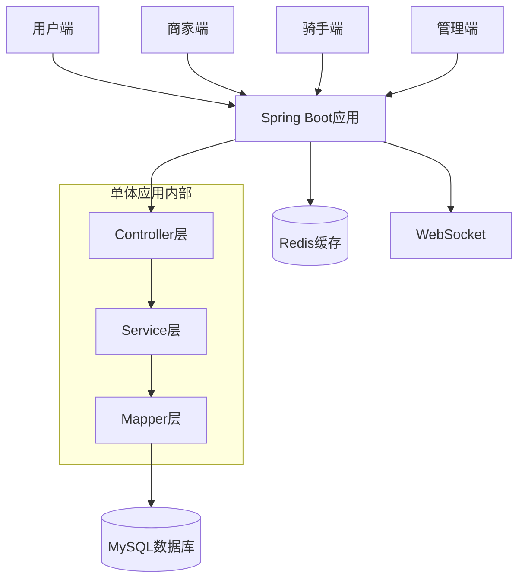

### 1.2 业务功能模块梳理

#### 1.2.1 核心业务域

| 业务域       | 核心功能               | 主要实体                     | 数据表                             |
| --------- | ------------------ | ------------------------ | ------------------------------- |
| **用户管理域** | 用户注册登录、个人信息管理、收藏浏览 | User, Favorite           | user, favorite, browse\_history |
| **商家管理域** | 商家注册、店铺管理、商品管理     | Merchant, Store, Product | merchant, store, product        |
| **订单管理域** | 订单创建、支付、状态流转、购物车   | Order, OrderItem, Cart   | order, order\_item, cart        |
| **配送管理域** | 骑手管理、订单分配、配送跟踪     | Rider                    | rider                           |
| **营销管理域** | 优惠券、评价、销售统计        | Coupon, Review, Sales    | coupon, review, sales           |
| **通信管理域** | 实时聊天、消息推送          | Message, ChatMessage     | message                         |

#### 1.2.2 业务流程分析

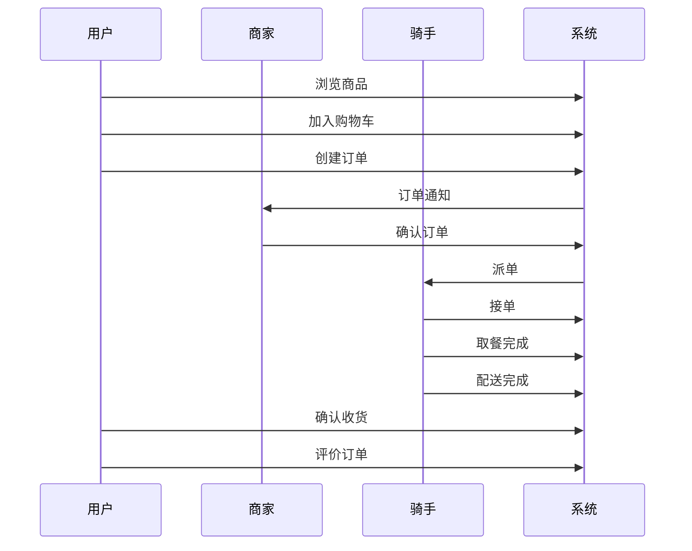

### 1.3 单体架构痛点分析

#### 1.3.1 技术痛点

| 痛点类别     | 具体问题                  | 影响程度 | 解决紧迫性 |
| -------- | --------------------- | ---- | ----- |
| **可扩展性** | 无法按业务模块独立扩展，高峰期整体性能瓶颈 | 高    | 高     |
| **可维护性** | 代码耦合度高，修改影响面大，测试复杂    | 高    | 高     |
| **技术栈**  | 技术选型受限，难以引入新技术        | 中    | 中     |
| **团队协作** | 多团队开发冲突，代码合并复杂        | 高    | 高     |
| **故障隔离** | 单点故障影响整个系统            | 高    | 高     |
| **部署效率** | 全量部署，发布周期长，回滚困难       | 中    | 中     |

#### 1.3.2 业务痛点

```
业务发展受限：
1. 新功能开发周期长，上线风险高
2. 业务高峰期系统整体性能下降
3. 不同业务模块无法独立优化
4. 数据库成为性能瓶颈
5. 第三方服务集成复杂
```

***

## 2. 微服务拆分策略

### 2.1 服务边界定义原则

#### 2.1.1 DDD领域驱动设计原则

```
拆分原则：
1. 业务边界清晰：按业务领域拆分，避免跨域操作
2. 数据独立性：每个服务拥有独立的数据存储
3. 团队自治：服务与团队组织结构对应
4. 技术异构：允许不同服务使用不同技术栈
5. 独立部署：服务可以独立开发、测试、部署
6. 故障隔离：单个服务故障不影响其他服务
```

#### 2.1.2 服务拆分决策矩阵

| 评估维度   | 权重   | 用户服务    | 商家服务    | 订单服务    | 配送服务    | 营销服务    | 通信服务    |
| ------ | ---- | ------- | ------- | ------- | ------- | ------- | ------- |
| 业务独立性  | 25%  | 9       | 9       | 8       | 8       | 7       | 9       |
| 数据独立性  | 20%  | 9       | 8       | 7       | 9       | 8       | 9       |
| 团队边界   | 15%  | 8       | 8       | 9       | 8       | 7       | 8       |
| 扩展需求   | 20%  | 8       | 7       | 9       | 8       | 6       | 7       |
| 技术差异   | 10%  | 7       | 7       | 8       | 7       | 8       | 9       |
| 变更频率   | 10%  | 7       | 8       | 9       | 7       | 8       | 6       |
| **总分** | 100% | **8.1** | **7.9** | **8.4** | **7.9** | **7.3** | **8.1** |

### 2.2 服务粒度规划

#### 2.2.1 微服务架构图

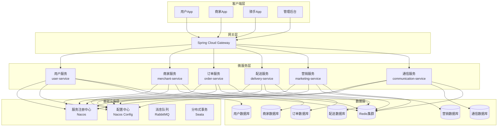

#### 2.2.2 服务详细规划

##### 用户服务 (user-service)

```yaml
服务职责：
  - 用户注册、登录、认证
  - 个人信息管理
  - 收藏和浏览历史
  - 用户权限管理

技术栈：
  - Spring Boot 3.1.5
  - Spring Security + JWT
  - MyBatis-Plus
  - Redis

数据库表：
  - user (用户基本信息)
  - favorite (收藏记录)
  - browse_history (浏览历史)

API接口：
  - POST /api/user/register
  - POST /api/user/login
  - GET /api/user/profile
  - PUT /api/user/profile
  - POST /api/user/favorite
```

##### 商家服务 (merchant-service)

```yaml
服务职责：
  - 商家注册和认证
  - 店铺信息管理
  - 商品CRUD操作
  - 商家端订单处理

技术栈：
  - Spring Boot 3.1.5
  - MyBatis-Plus
  - Redis
  - Elasticsearch (商品搜索)

数据库表：
  - merchant (商家信息)
  - store (店铺信息)
  - product (商品信息)

API接口：
  - POST /api/merchant/register
  - GET /api/merchant/stores
  - POST /api/merchant/product
  - PUT /api/merchant/product/{id}
```

##### 订单服务 (order-service)

```yaml
服务职责：
  - 订单创建和支付
  - 订单状态流转
  - 购物车管理
  - 订单历史查询

技术栈：
  - Spring Boot 3.1.5
  - MyBatis-Plus
  - Redis
  - RabbitMQ
  - Seata (分布式事务)

数据库表：
  - order (订单主表)
  - order_item (订单明细)
  - cart (购物车)

API接口：
  - POST /api/order/create
  - GET /api/order/{id}
  - PUT /api/order/{id}/status
  - GET /api/order/history
```

##### 配送服务 (delivery-service)

```yaml
服务职责：
  - 骑手注册和管理
  - 订单分配和抢单
  - 配送状态跟踪
  - 骑手收入统计

技术栈：
  - Spring Boot 3.1.5
  - MyBatis-Plus
  - Redis
  - WebSocket (实时位置)

数据库表：
  - rider (骑手信息)
  - delivery_order (配送订单)

API接口：
  - POST /api/delivery/rider/register
  - GET /api/delivery/orders/available
  - POST /api/delivery/order/grab
  - PUT /api/delivery/order/{id}/status
```

##### 营销服务 (marketing-service)

```yaml
服务职责：
  - 优惠券发放和使用
  - 用户评价管理
  - 销售数据统计
  - 营销活动管理

技术栈：
  - Spring Boot 3.1.5
  - MyBatis-Plus
  - Redis
  - ClickHouse (数据分析)

数据库表：
  - coupon (优惠券)
  - review (评价)
  - sales (销售记录)

API接口：
  - POST /api/marketing/coupon/issue
  - POST /api/marketing/review
  - GET /api/marketing/stats/sales
```

##### 通信服务 (communication-service)

```yaml
服务职责：
  - WebSocket聊天功能
  - 系统消息推送
  - 通知管理

技术栈：
  - Spring Boot 3.1.5
  - WebSocket
  - RabbitMQ
  - Redis

数据库表：
  - message (消息记录)
  - notification (通知)

API接口：
  - WebSocket /ws/chat
  - POST /api/communication/message
  - GET /api/communication/messages
```

#### 2.2.3 数据库拆分策略

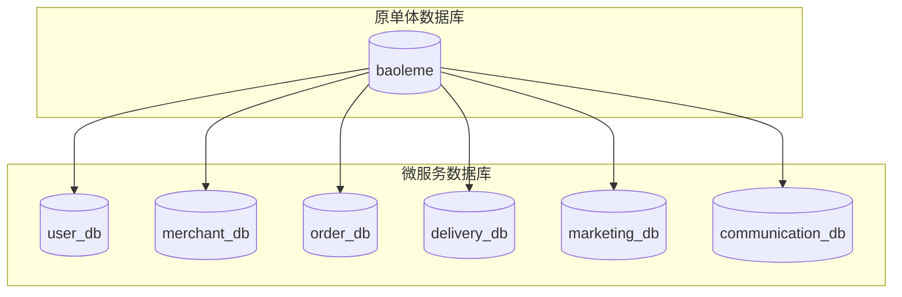

**数据拆分原则：**

1. **垂直拆分**：按业务域拆分表
2. **数据一致性**：通过分布式事务保证
3. **外键处理**：移除物理外键，使用逻辑关联
4. **数据同步**：迁移期间双写验证

***

## 3. 技术架构设计

### 3.1 服务注册与发现方案

#### 3.1.1 Nacos架构设计

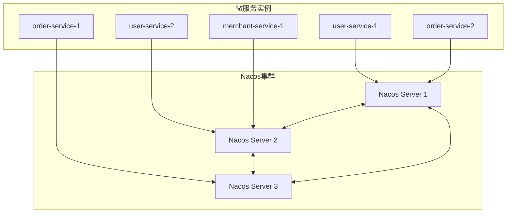

#### 3.1.2 Nacos配置

**服务端配置 (application.yml)**

```yaml
spring:
  cloud:
    nacos:
      discovery:
        server-addr: nacos-cluster:8848
        namespace: baoleme-prod
        group: DEFAULT_GROUP
        cluster-name: BJ
        metadata:
          version: 1.0.0
          region: beijing
      config:
        server-addr: nacos-cluster:8848
        namespace: baoleme-prod
        group: DEFAULT_GROUP
        file-extension: yml
        shared-configs:
          - data-id: common-config.yml
            group: SHARED_GROUP
            refresh: true
```

**客户端配置示例**

```yaml
# user-service配置
spring:
  application:
    name: user-service
  cloud:
    nacos:
      discovery:
        server-addr: ${NACOS_SERVER:localhost:8848}
        heart-beat-interval: 5000
        heart-beat-timeout: 15000
        ip: ${SPRING_CLOUD_CLIENT_IP_ADDRESS:}
        port: ${server.port}
        weight: 1
        healthy: true
        enabled: true
```

### 3.2 API网关选型与配置

#### 3.2.1 Spring Cloud Gateway架构

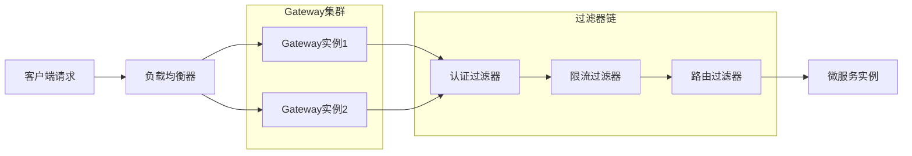

#### 3.2.2 Gateway配置

**网关路由配置**

```yaml
spring:
  cloud:
    gateway:
      routes:
        # 用户服务路由
        - id: user-service
          uri: lb://user-service
          predicates:
            - Path=/api/user/**
          filters:
            - name: RequestRateLimiter
              args:
                redis-rate-limiter.replenishRate: 100
                redis-rate-limiter.burstCapacity: 200
                key-resolver: "#{@userKeyResolver}"
            - name: AuthFilter
        
        # 订单服务路由
        - id: order-service
          uri: lb://order-service
          predicates:
            - Path=/api/order/**
          filters:
            - name: RequestRateLimiter
              args:
                redis-rate-limiter.replenishRate: 50
                redis-rate-limiter.burstCapacity: 100
            - name: AuthFilter
        
        # 商家服务路由
        - id: merchant-service
          uri: lb://merchant-service
          predicates:
            - Path=/api/merchant/**
          filters:
            - name: AuthFilter
            - name: MerchantRoleFilter
      
      # 全局过滤器
      default-filters:
        - name: GlobalLoggingFilter
        - name: GlobalExceptionFilter
```

**自定义过滤器实现**

```java
/**
 * 认证过滤器
 * 负责JWT token验证和用户身份识别
 */
@Component
public class AuthFilter implements GatewayFilter, Ordered {
    
    private final JwtUtils jwtUtils;
    private final RedisTemplate<String, Object> redisTemplate;
    
    /**
     * 过滤器执行逻辑
     * @param exchange 请求交换对象
     * @param chain 过滤器链
     * @return 过滤结果
     */
    @Override
    public Mono<Void> filter(ServerWebExchange exchange, GatewayFilterChain chain) {
        ServerHttpRequest request = exchange.getRequest();
        String token = extractToken(request);
        
        if (StringUtils.isEmpty(token)) {
            return unauthorized(exchange);
        }
        
        try {
            // 验证token
            Claims claims = jwtUtils.parseToken(token);
            Long userId = claims.get("userId", Long.class);
            String role = claims.get("role", String.class);
            
            // 检查Redis中的token状态
            String tokenKey = "user:token:" + token;
            if (!redisTemplate.hasKey(tokenKey)) {
                return unauthorized(exchange);
            }
            
            // 添加用户信息到请求头
            ServerHttpRequest mutatedRequest = request.mutate()
                .header("X-User-Id", userId.toString())
                .header("X-User-Role", role)
                .build();
            
            return chain.filter(exchange.mutate().request(mutatedRequest).build());
            
        } catch (Exception e) {
            return unauthorized(exchange);
        }
    }
    
    /**
     * 提取请求中的token
     * @param request HTTP请求
     * @return JWT token
     */
    private String extractToken(ServerHttpRequest request) {
        String authHeader = request.getHeaders().getFirst("Authorization");
        if (authHeader != null && authHeader.startsWith("Bearer ")) {
            return authHeader.substring(7);
        }
        return null;
    }
    
    /**
     * 返回未授权响应
     * @param exchange 请求交换对象
     * @return 未授权响应
     */
    private Mono<Void> unauthorized(ServerWebExchange exchange) {
        ServerHttpResponse response = exchange.getResponse();
        response.setStatusCode(HttpStatus.UNAUTHORIZED);
        return response.setComplete();
    }
    
    @Override
    public int getOrder() {
        return -100;
    }
}
```

### 3.3 分布式事务处理机制

#### 3.3.1 Seata架构设计

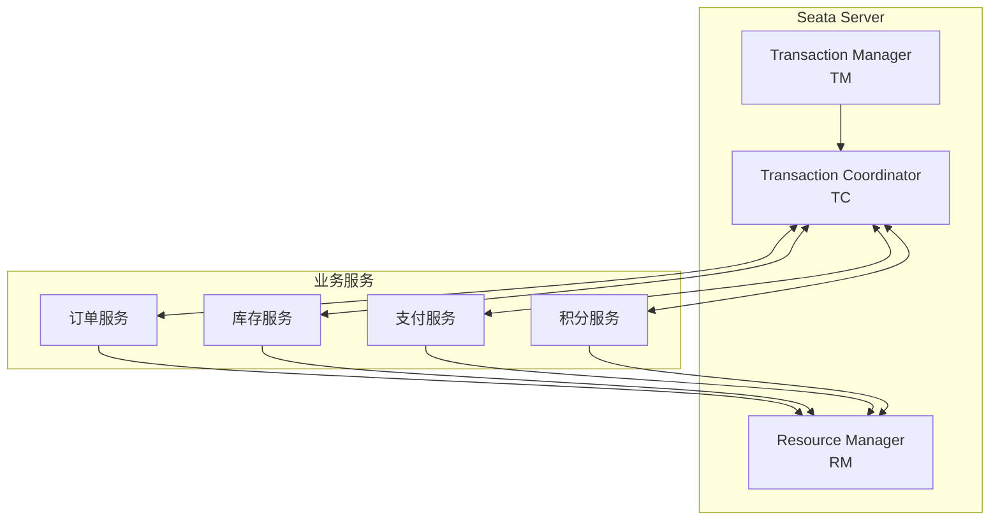

#### 3.3.2 分布式事务实现

**订单创建事务示例**

```java
/**
 * 订单服务实现类
 * 处理订单创建的分布式事务
 */
@Service
public class OrderServiceImpl implements OrderService {
    
    @Autowired
    private OrderMapper orderMapper;
    
    @Autowired
    private ProductService productService;
    
    @Autowired
    private PaymentService paymentService;
    
    @Autowired
    private CouponService couponService;
    
    /**
     * 创建订单 - 分布式事务
     * @param request 订单创建请求
     * @return 订单创建结果
     * @throws BusinessException 业务异常
     */
    @Override
    @GlobalTransactional(name = "create-order", rollbackFor = Exception.class)
    public OrderCreateResponse createOrder(OrderCreateRequest request) throws BusinessException {
        
        try {
            // 1. 创建订单记录
            Order order = buildOrder(request);
            orderMapper.insert(order);
            
            // 2. 扣减商品库存 (调用商家服务)
            for (OrderItem item : request.getItems()) {
                boolean stockReduced = productService.reduceStock(
                    item.getProductId(), 
                    item.getQuantity()
                );
                if (!stockReduced) {
                    throw new BusinessException("商品库存不足");
                }
            }
            
            // 3. 处理优惠券 (调用营销服务)
            if (request.getCouponId() != null) {
                boolean couponUsed = couponService.useCoupon(
                    request.getUserId(), 
                    request.getCouponId()
                );
                if (!couponUsed) {
                    throw new BusinessException("优惠券使用失败");
                }
            }
            
            // 4. 创建支付订单 (调用支付服务)
            PaymentCreateRequest paymentRequest = PaymentCreateRequest.builder()
                .orderId(order.getId())
                .amount(order.getActualPrice())
                .userId(request.getUserId())
                .build();
            
            PaymentCreateResponse paymentResponse = paymentService.createPayment(paymentRequest);
            
            // 5. 清空购物车
            cartService.clearCart(request.getUserId(), request.getStoreId());
            
            return OrderCreateResponse.builder()
                .orderId(order.getId())
                .paymentId(paymentResponse.getPaymentId())
                .totalAmount(order.getTotalPrice())
                .actualAmount(order.getActualPrice())
                .build();
                
        } catch (Exception e) {
            log.error("订单创建失败: {}", e.getMessage(), e);
            throw new BusinessException("订单创建失败: " + e.getMessage());
        }
    }
    
    /**
     * 构建订单对象
     * @param request 订单创建请求
     * @return 订单对象
     */
    private Order buildOrder(OrderCreateRequest request) {
        Order order = new Order();
        order.setUserId(request.getUserId());
        order.setStoreId(request.getStoreId());
        order.setStatus(0); // 待支付
        order.setUserLocation(request.getUserLocation());
        order.setRemark(request.getRemark());
        
        // 计算订单金额
        BigDecimal totalPrice = calculateTotalPrice(request.getItems());
        BigDecimal deliveryPrice = calculateDeliveryPrice(request);
        BigDecimal actualPrice = totalPrice.add(deliveryPrice);
        
        // 应用优惠券折扣
        if (request.getCouponId() != null) {
            BigDecimal discount = couponService.calculateDiscount(
                request.getCouponId(), totalPrice
            );
            actualPrice = actualPrice.subtract(discount);
        }
        
        order.setTotalPrice(totalPrice);
        order.setDeliveryPrice(deliveryPrice);
        order.setActualPrice(actualPrice);
        order.setCreatedAt(LocalDateTime.now());
        
        return order;
    }
}
```

**Seata配置**

```yaml
# Seata配置
seata:
  enabled: true
  application-id: order-service
  tx-service-group: baoleme-tx-group
  service:
    vgroup-mapping:
      baoleme-tx-group: default
    grouplist:
      default: 127.0.0.1:8091
  config:
    type: nacos
    nacos:
      server-addr: 127.0.0.1:8848
      group: SEATA_GROUP
      namespace: seata
  registry:
    type: nacos
    nacos:
      application: seata-server
      server-addr: 127.0.0.1:8848
      group: SEATA_GROUP
      namespace: seata
```

### 3.4 服务监控方案

#### 3.4.1 监控架构设计

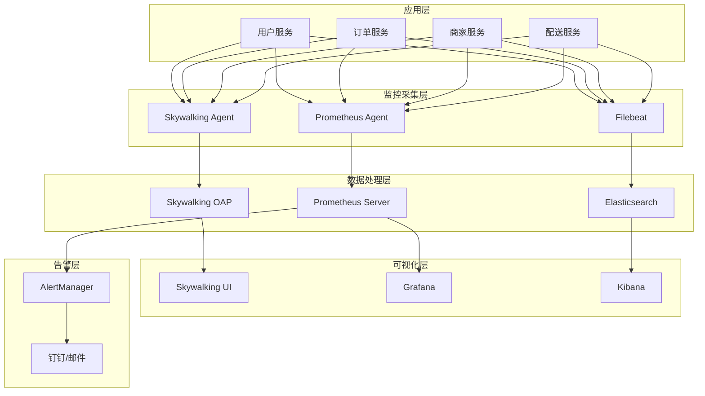

#### 3.4.2 Skywalking链路追踪配置

**Agent配置**

```bash
# JVM启动参数
-javaagent:/opt/skywalking/agent/skywalking-agent.jar
-Dskywalking.agent.service_name=user-service
-Dskywalking.collector.backend_service=skywalking-oap:11800
-Dskywalking.agent.sample_n_per_3_secs=100
```

**自定义埋点**

```java
/**
 * 用户服务实现类
 * 包含自定义链路追踪埋点
 */
@Service
public class UserServiceImpl implements UserService {
    
    /**
     * 用户登录方法
     * @param phone 手机号
     * @param password 密码
     * @return 用户信息
     */
    @Trace(operationName = "user-login")
    @Tags({
        @Tag(key = "user.phone", value = "arg[0]"),
        @Tag(key = "operation.type", value = "login")
    })
    @Override
    public User login(String phone, String password) {
        
        // 创建自定义Span
        AbstractSpan span = ContextManager.createLocalSpan("validate-user-credentials");
        span.tag("phone", phone);
        
        try {
            // 验证用户凭据
            User user = userMapper.findByPhone(phone);
            if (user == null) {
                span.tag("result", "user_not_found");
                return null;
            }
            
            if (!passwordEncoder.matches(password, user.getPassword())) {
                span.tag("result", "password_mismatch");
                return null;
            }
            
            span.tag("result", "success");
            span.tag("user.id", user.getId().toString());
            
            return user;
            
        } catch (Exception e) {
            span.tag("error", true);
            span.log(e);
            throw e;
        } finally {
            ContextManager.stopSpan();
        }
    }
}
```

#### 3.4.3 Prometheus监控配置

**应用监控配置**

```yaml
# application.yml
management:
  endpoints:
    web:
      exposure:
        include: health,info,metrics,prometheus
  endpoint:
    health:
      show-details: always
    metrics:
      enabled: true
  metrics:
    export:
      prometheus:
        enabled: true
    distribution:
      percentiles-histogram:
        http.server.requests: true
      percentiles:
        http.server.requests: 0.5,0.9,0.95,0.99
```

**自定义业务指标**

```java
/**
 * 订单服务监控指标
 */
@Component
public class OrderMetrics {
    
    private final Counter orderCreatedCounter;
    private final Timer orderProcessingTimer;
    private final Gauge activeOrdersGauge;
    
    public OrderMetrics(MeterRegistry meterRegistry) {
        this.orderCreatedCounter = Counter.builder("orders.created.total")
            .description("Total number of orders created")
            .tag("service", "order-service")
            .register(meterRegistry);
            
        this.orderProcessingTimer = Timer.builder("orders.processing.duration")
            .description("Order processing duration")
            .register(meterRegistry);
            
        this.activeOrdersGauge = Gauge.builder("orders.active.count")
            .description("Number of active orders")
            .register(meterRegistry, this, OrderMetrics::getActiveOrderCount);
    }
    
    /**
     * 记录订单创建事件
     * @param storeId 店铺ID
     * @param userId 用户ID
     */
    public void recordOrderCreated(Long storeId, Long userId) {
        orderCreatedCounter.increment(
            Tags.of(
                "store.id", storeId.toString(),
                "user.id", userId.toString()
            )
        );
    }
    
    /**
     * 记录订单处理时间
     * @param duration 处理时长
     * @param status 订单状态
     */
    public void recordOrderProcessingTime(Duration duration, String status) {
        orderProcessingTimer.record(duration, Tags.of("status", status));
    }
    
    /**
     * 获取活跃订单数量
     * @return 活跃订单数
     */
    private double getActiveOrderCount() {
        // 实现获取活跃订单数的逻辑
        return orderService.getActiveOrderCount();
    }
}
```

**Grafana仪表板配置**

```json
{
  "dashboard": {
    "title": "饱了么微服务监控",
    "panels": [
      {
        "title": "服务QPS",
        "type": "graph",
        "targets": [
          {
            "expr": "rate(http_server_requests_seconds_count[5m])",
            "legendFormat": "{{service}}"
          }
        ]
      },
      {
        "title": "服务响应时间",
        "type": "graph",
        "targets": [
          {
            "expr": "histogram_quantile(0.95, rate(http_server_requests_seconds_bucket[5m]))",
            "legendFormat": "95th percentile"
          }
        ]
      },
      {
        "title": "错误率",
        "type": "singlestat",
        "targets": [
          {
            "expr": "rate(http_server_requests_seconds_count{status=~\"5..\"}[5m]) / rate(http_server_requests_seconds_count[5m])"
          }
        ]
      }
    ]
  }
}
```

***

## 4. 实施路线图

### 4.1 分阶段迁移计划

#### 4.1.1 整体迁移时间线

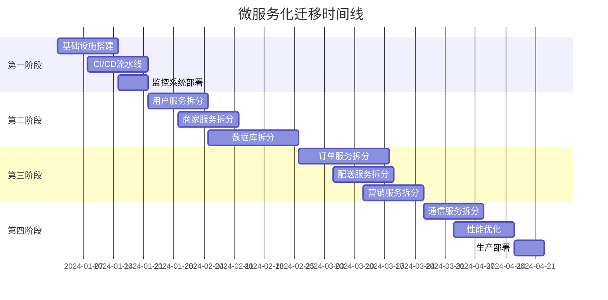

#### 4.1.2 第一阶段：基础设施搭建 (2-3周)

**目标**：建设微服务基础设施

**主要任务**：

1. **服务注册中心部署**

   ```bash
   # Nacos集群部署
   docker-compose up -d nacos-cluster

   # 验证集群状态
   curl http://nacos1:8848/nacos/v1/ns/operator/servers
   ```

2. **API网关部署**

   ```yaml
   # gateway-service部署配置
   apiVersion: apps/v1
   kind: Deployment
   metadata:
     name: gateway-service
   spec:
     replicas: 2
     selector:
       matchLabels:
         app: gateway-service
     template:
       spec:
         containers:
         - name: gateway
           image: baoleme/gateway-service:1.0.0
           ports:
           - containerPort: 8080
   ```

3. **监控系统搭建**

   ```bash
   # 部署监控组件
   kubectl apply -f monitoring/

   # 验证监控服务
   kubectl get pods -n monitoring
   ```

**交付物**：

* Nacos集群运行正常

* Gateway服务可访问

* 监控面板可查看

* CI/CD流水线就绪

#### 4.1.3 第二阶段：核心服务拆分 (3-4周)

**目标**：拆分用户服务和商家服务

**用户服务拆分步骤**：

1. **创建用户服务项目**

   ```bash
   # 创建项目结构
   mkdir -p baoleme-user-service/src/main/java/com/baoleme/user

   # 复制相关代码
   cp -r src/main/java/org/demo/baoleme/controller/UserController.java \
         baoleme-user-service/src/main/java/com/baoleme/user/controller/
   ```

2. **数据库迁移**

   ```sql
   -- 创建用户服务数据库
   CREATE DATABASE baoleme_user;

   -- 迁移用户相关表
   CREATE TABLE baoleme_user.user AS SELECT * FROM baoleme.user;
   CREATE TABLE baoleme_user.favorite AS SELECT * FROM baoleme.favorite;
   CREATE TABLE baoleme_user.browse_history AS SELECT * FROM baoleme.browse_history;
   ```

3. **服务注册配置**

   ```yaml
   # user-service配置
   spring:
     application:
       name: user-service
     cloud:
       nacos:
         discovery:
           server-addr: nacos-cluster:8848
   ```

4. **接口适配**

   ```java
   /**
    * 用户服务Feign客户端
    */
   @FeignClient(name = "user-service")
   public interface UserServiceClient {
       
       @GetMapping("/api/user/{id}")
       CommonResponse<User> getUserById(@PathVariable Long id);
       
       @PostMapping("/api/user/validate")
       CommonResponse<Boolean> validateUser(@RequestBody UserValidateRequest request);
   }
   ```

**商家服务拆分步骤**：

1. **服务代码迁移**
2. **商家数据库创建**
3. **商品搜索集成**
4. **服务间调用适配**

**验收标准**：

* 用户注册登录功能正常

* 商家管理功能正常

* 服务间调用成功

* 数据一致性验证通过

#### 4.1.4 第三阶段：业务服务拆分 (4-5周)

**目标**：拆分订单、配送、营销服务

**订单服务拆分重点**：

1. **分布式事务改造**

   ```java
   @GlobalTransactional
   public OrderCreateResponse createOrder(OrderCreateRequest request) {
       // 分布式事务逻辑
   }
   ```

2. **消息队列集成**

   ```java
   @RabbitListener(queues = "order.created")
   public void handleOrderCreated(OrderCreatedEvent event) {
       // 处理订单创建事件
   }
   ```

3. **缓存策略优化**

   ```java
   @Cacheable(value = "orders", key = "#orderId")
   public Order getOrderById(Long orderId) {
       return orderMapper.selectById(orderId);
   }
   ```

**配送服务拆分重点**：

1. **实时位置追踪**
2. **订单分配算法**
3. **骑手状态管理**

**营销服务拆分重点**：

1. **优惠券规则引擎**
2. **数据统计分析**
3. **评价系统重构**

#### 4.1.5 第四阶段：完善优化 (2-3周)

**目标**：系统优化和生产部署

**主要任务**：

1. **通信服务拆分**
2. **性能压测优化**
3. **安全加固**
4. **生产环境部署**

### 4.2 服务依赖关系管理

#### 4.2.1 服务依赖图

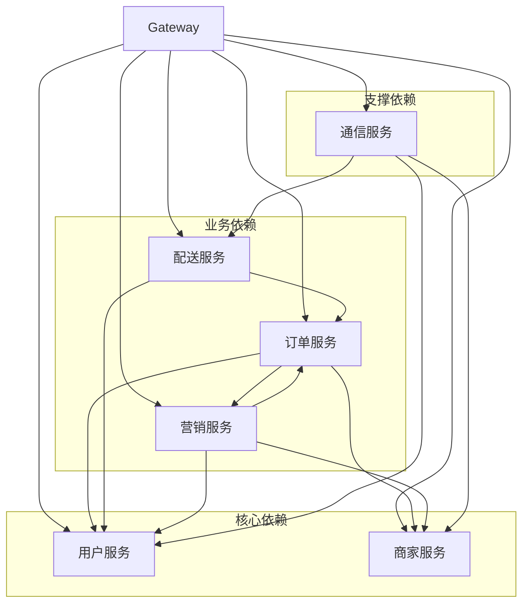

#### 4.2.2 依赖管理策略

**1. 循环依赖处理**

```java
/**
 * 异步事件处理避免循环依赖
 */
@EventListener
@Async
public void handleOrderStatusChanged(OrderStatusChangedEvent event) {
    // 异步处理订单状态变更
    if (event.getStatus() == OrderStatus.COMPLETED) {
        // 通知营销服务更新统计
        marketingService.updateSalesStats(event.getOrderId());
        
        // 通知配送服务更新骑手收入
        deliveryService.updateRiderEarnings(event.getRiderId());
    }
}
```

**2. 服务降级策略**

```java
/**
 * 用户服务客户端降级
 */
@Component
public class UserServiceFallback implements UserServiceClient {
    
    @Override
    public CommonResponse<User> getUserById(Long id) {
        // 返回缓存用户信息或默认信息
        User defaultUser = User.builder()
            .id(id)
            .username("用户" + id)
            .build();
        return CommonResponse.success(defaultUser);
    }
}
```

**3. 接口版本管理**

```java
/**
 * API版本控制
 */
@RestController
@RequestMapping("/api/v1/user")
public class UserControllerV1 {
    // V1版本接口
}

@RestController
@RequestMapping("/api/v2/user")
public class UserControllerV2 {
    // V2版本接口，向后兼容
}
```

### 4.3 数据迁移策略

#### 4.3.1 数据迁移流程

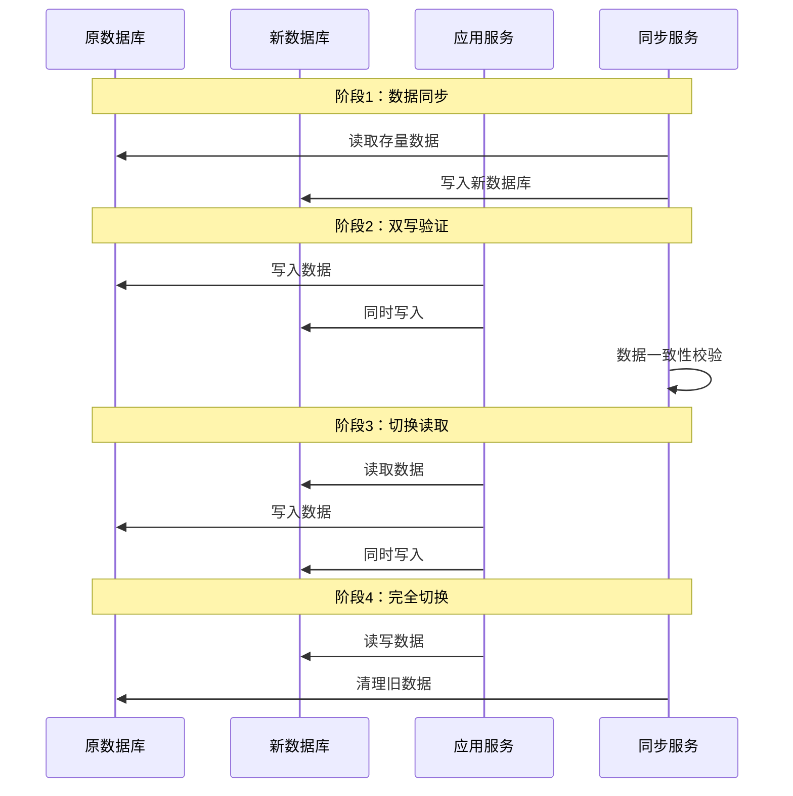

#### 4.3.2 数据迁移脚本

**用户数据迁移**

```sql
-- 用户数据迁移脚本
DELIMITER $$

CREATE PROCEDURE MigrateUserData()
BEGIN
    DECLARE done INT DEFAULT FALSE;
    DECLARE batch_size INT DEFAULT 1000;
    DECLARE offset_val INT DEFAULT 0;
    DECLARE total_count INT;
    
    -- 获取总记录数
    SELECT COUNT(*) INTO total_count FROM baoleme.user;
    
    WHILE offset_val < total_count DO
        -- 批量迁移用户数据
        INSERT INTO baoleme_user.user 
        SELECT * FROM baoleme.user 
        LIMIT batch_size OFFSET offset_val;
        
        -- 迁移收藏数据
        INSERT INTO baoleme_user.favorite 
        SELECT f.* FROM baoleme.favorite f
        INNER JOIN baoleme.user u ON f.user_id = u.id
        WHERE u.id IN (
            SELECT id FROM baoleme.user 
            LIMIT batch_size OFFSET offset_val
        );
        
        SET offset_val = offset_val + batch_size;
        
        -- 记录迁移进度
        INSERT INTO migration_log (table_name, migrated_count, total_count, created_at)
        VALUES ('user', offset_val, total_count, NOW());
        
    END WHILE;
END$$

DELIMITER ;
```

**数据一致性校验**

```java
/**
 * 数据一致性校验服务
 */
@Service
public class DataConsistencyChecker {
    
    @Autowired
    private JdbcTemplate oldDbTemplate;
    
    @Autowired
    private JdbcTemplate newDbTemplate;
    
    /**
     * 校验用户数据一致性
     * @return 校验结果
     */
    public ConsistencyCheckResult checkUserDataConsistency() {
        
        ConsistencyCheckResult result = new ConsistencyCheckResult();
        
        // 1. 检查记录数量
        Long oldCount = oldDbTemplate.queryForObject(
            "SELECT COUNT(*) FROM user", Long.class
        );
        Long newCount = newDbTemplate.queryForObject(
            "SELECT COUNT(*) FROM user", Long.class
        );
        
        result.setOldCount(oldCount);
        result.setNewCount(newCount);
        result.setCountMatch(oldCount.equals(newCount));
        
        // 2. 检查数据完整性
        List<Long> missingIds = newDbTemplate.queryForList(
            "SELECT u1.id FROM baoleme.user u1 " +
            "LEFT JOIN baoleme_user.user u2 ON u1.id = u2.id " +
            "WHERE u2.id IS NULL",
            Long.class
        );
        
        result.setMissingIds(missingIds);
        result.setDataComplete(missingIds.isEmpty());
        
        // 3. 检查关键字段一致性
        List<Map<String, Object>> inconsistentRecords = newDbTemplate.queryForList(
            "SELECT u1.id, u1.username as old_username, u2.username as new_username " +
            "FROM baoleme.user u1 " +
            "INNER JOIN baoleme_user.user u2 ON u1.id = u2.id " +
            "WHERE u1.username != u2.username OR u1.phone != u2.phone"
        );
        
        result.setInconsistentRecords(inconsistentRecords);
        result.setDataConsistent(inconsistentRecords.isEmpty());
        
        return result;
    }
    
    /**
     * 修复数据不一致问题
     * @param checkResult 校验结果
     */
    @Transactional
    public void fixDataInconsistency(ConsistencyCheckResult checkResult) {
        
        // 修复缺失数据
        for (Long missingId : checkResult.getMissingIds()) {
            Map<String, Object> userData = oldDbTemplate.queryForMap(
                "SELECT * FROM user WHERE id = ?", missingId
            );
            
            newDbTemplate.update(
                "INSERT INTO user (id, username, password, phone, created_at) " +
                "VALUES (?, ?, ?, ?, ?)",
                userData.get("id"),
                userData.get("username"),
                userData.get("password"),
                userData.get("phone"),
                userData.get("created_at")
            );
        }
        
        // 修复不一致数据
        for (Map<String, Object> record : checkResult.getInconsistentRecords()) {
            Long userId = (Long) record.get("id");
            Map<String, Object> correctData = oldDbTemplate.queryForMap(
                "SELECT * FROM user WHERE id = ?", userId
            );
            
            newDbTemplate.update(
                "UPDATE user SET username = ?, phone = ? WHERE id = ?",
                correctData.get("username"),
                correctData.get("phone"),
                userId
            );
        }
    }
}
```

#### 4.3.3 回滚策略

**自动回滚机制**

```java
/**
 * 迁移回滚服务
 */
@Service
public class MigrationRollbackService {
    
    /**
     * 检查迁移健康状态
     * @return 健康检查结果
     */
    @Scheduled(fixedRate = 30000) // 每30秒检查一次
    public void checkMigrationHealth() {
        
        MigrationHealthStatus status = new MigrationHealthStatus();
        
        // 检查服务可用性
        status.setUserServiceAvailable(checkServiceHealth("user-service"));
        status.setMerchantServiceAvailable(checkServiceHealth("merchant-service"));
        status.setOrderServiceAvailable(checkServiceHealth("order-service"));
        
        // 检查数据一致性
        status.setDataConsistent(checkDataConsistency());
        
        // 检查错误率
        status.setErrorRateAcceptable(checkErrorRate() < 0.01); // 错误率小于1%
        
        // 如果健康检查失败，触发回滚
        if (!status.isHealthy()) {
            log.error("迁移健康检查失败，触发自动回滚: {}", status);
            triggerRollback(status);
        }
    }
    
    /**
     * 触发回滚操作
     * @param healthStatus 健康状态
     */
    private void triggerRollback(MigrationHealthStatus healthStatus) {
        
        try {
            // 1. 停止新服务流量
            gatewayService.stopTrafficToNewServices();
            
            // 2. 恢复到原服务
            gatewayService.routeTrafficToOldService();
            
            // 3. 数据回滚
            if (!healthStatus.isDataConsistent()) {
                dataRollbackService.rollbackToLastConsistentState();
            }
            
            // 4. 发送告警通知
            alertService.sendRollbackAlert(healthStatus);
            
            log.info("自动回滚完成");
            
        } catch (Exception e) {
            log.error("自动回滚失败，需要人工介入: {}", e.getMessage(), e);
            alertService.sendCriticalAlert("自动回滚失败", e);
        }
    }
}
```

***

## 5. 风险评估与应对

### 5.1 技术风险

| 风险类别      | 风险描述              | 影响程度 | 发生概率 | 应对措施             |
| --------- | ----------------- | ---- | ---- | ---------------- |
| **服务拆分**  | 服务边界划分不当导致频繁跨服务调用 | 高    | 中    | 重新评估服务边界，合并高耦合服务 |
| **数据一致性** | 分布式事务失败导致数据不一致    | 高    | 中    | 实施最终一致性，增加补偿机制   |
| **性能下降**  | 网络调用增加导致响应时间变长    | 中    | 高    | 优化服务调用，增加缓存策略    |
| **运维复杂度** | 微服务数量增加运维难度       | 中    | 高    | 完善监控告警，自动化运维     |

### 5.2 业务风险

| 风险类别     | 风险描述         | 影响程度 | 发生概率 | 应对措施          |
| -------- | ------------ | ---- | ---- | ------------- |
| **服务中断** | 迁移过程中服务不可用   | 高    | 低    | 蓝绿部署，快速回滚机制   |
| **数据丢失** | 迁移过程中数据丢失或损坏 | 高    | 低    | 完整备份策略，数据校验机制 |
| **业务中断** | 关键业务功能受影响    | 高    | 低    | 分阶段迁移，保持业务连续性 |

### 5.3 应急预案

#### 5.3.1 快速回滚方案

```bash
# 紧急回滚脚本
#!/bin/bash
echo "开始紧急回滚..."

# 1. 切换网关路由到原服务
kubectl patch configmap gateway-config --patch '{"data":{"route-config":"legacy"}}'

# 2. 停止新服务
kubectl scale deployment user-service --replicas=0
kubectl scale deployment merchant-service --replicas=0

# 3. 恢复原服务
kubectl scale deployment baoleme-monolith --replicas=3

# 4. 数据库切换
mysql -e "UPDATE gateway_config SET active_db='legacy' WHERE service='all';"

echo "紧急回滚完成"
```

#### 5.3.2 数据恢复方案

```sql
-- 数据恢复脚本
DELIMITER $$

CREATE PROCEDURE EmergencyDataRestore()
BEGIN
    DECLARE EXIT HANDLER FOR SQLEXCEPTION
    BEGIN
        ROLLBACK;
        RESIGNAL;
    END;
    
    START TRANSACTION;
    
    -- 恢复用户数据
    DELETE FROM baoleme_user.user WHERE created_at > (SELECT MAX(backup_time) FROM backup_log);
    INSERT INTO baoleme_user.user SELECT * FROM baoleme_backup.user_backup;
    
    -- 恢复订单数据
    DELETE FROM baoleme_order.order WHERE created_at > (SELECT MAX(backup_time) FROM backup_log);
    INSERT INTO baoleme_order.order SELECT * FROM baoleme_backup.order_backup;
    
    COMMIT;
END$$

DELIMITER ;
```

***

## 6. 成本效益分析

### 6.1 实施成本

| 成本类别     | 预估成本   | 说明           |
| -------- | ------ | ------------ |
| **人力成本** | 120人天  | 开发团队6人×20天   |
| **基础设施** | 15万元/年 | 服务器、中间件、监控工具 |
| **培训成本** | 5万元    | 团队微服务技术培训    |
| **风险成本** | 10万元   | 潜在业务损失预留     |
| **总计**   | 150万元  | 首年总投入        |

### 6.2 预期收益

| 收益类别        | 年化收益  | 说明             |
| ----------- | ----- | -------------- |
| **开发效率提升**  | 30%   | 团队并行开发，减少冲突    |
| **系统可用性提升** | 99.9% | 故障隔离，局部故障不影响整体 |
| **运维成本降低**  | 20%   | 自动化运维，精准扩容     |
| **业务响应速度**  | 50%   | 快速迭代，独立部署      |

### 6.3 ROI分析

```
投资回报率计算：
- 年化收益：开发效率提升节省成本60万 + 运维成本降低20万 = 80万
- 投资成本：150万（首年）
- ROI = (80万 - 150万) / 150万 = -47%（首年）
- 第二年ROI = 80万 / 150万 = 53%
- 第三年累计ROI = (80万×3 - 150万) / 150万 = 60%
```

***

## 7. 总结与建议

### 7.1 核心价值

1. **技术架构现代化**：从单体架构升级到微服务架构，提升系统的可扩展性和可维护性
2. **团队协作优化**：支持多团队并行开发，提高开发效率
3. **业务敏捷性增强**：支持快速迭代和独立部署，加快产品上线速度
4. **系统稳定性提升**：通过服务隔离和熔断机制，提高系统整体可用性

### 7.2 关键成功因素

1. **渐进式迁移**：采用分阶段迁移策略，降低风险
2. **完善的监控**：建立全面的监控体系，及时发现和解决问题
3. **团队能力建设**：加强微服务相关技术培训
4. **自动化工具**：完善CI/CD流水线和自动化测试

### 7.3 实施建议

1. **优先级排序**：按照业务重要性和技术复杂度确定服务拆分优先级
2. **小步快跑**：每个阶段完成后进行充分验证再进入下一阶段
3. **持续优化**：迁移完成后持续监控和优化系统性能
4. **文档完善**：建立完整的技术文档和操作手册

### 7.4 后续规划

1. **服务网格引入**：考虑引入Istio等服务网格技术
2. **容器化部署**：全面容器化部署，提升资源利用率
3. **DevOps深化**：建立更完善的DevOps流程
4. **数据中台建设**：统一数据服务和分析能力

***

**文档版本历史**

| 版本   | 日期         | 修改内容 | 修改人  |
| ---- | ---------- | ---- | ---- |
| v1.0 | 2024-01-01 | 初始版本 | 架构团队 |

**附录**

* \[A] 详细的API接口文档

* \[B] 数据库设计文档

* \[C] 部署运维手册

* \[D] 性能测试报告

* \[E] 安全评估报告

