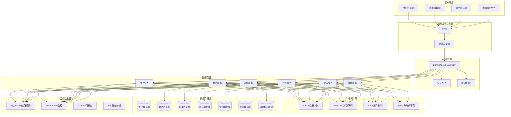
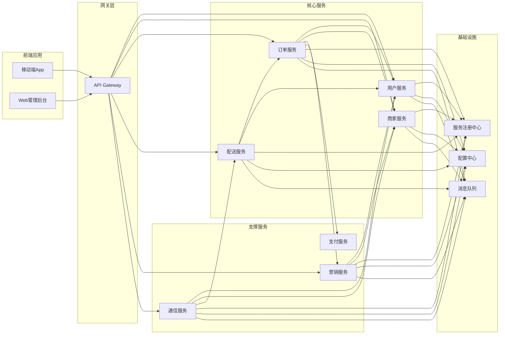
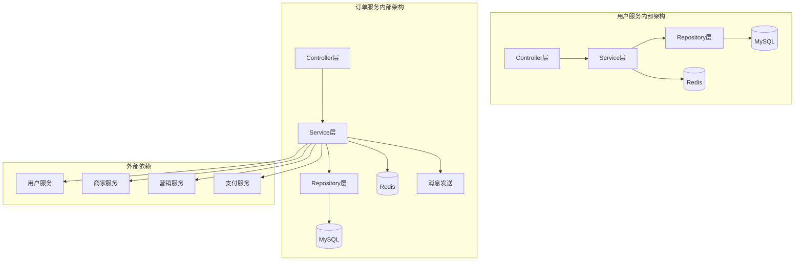
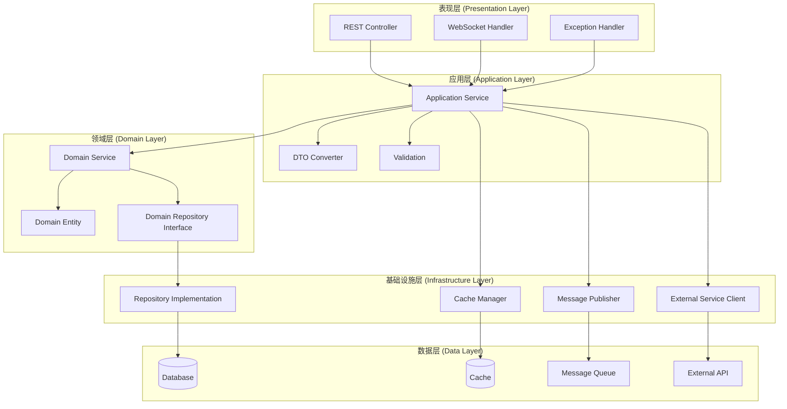
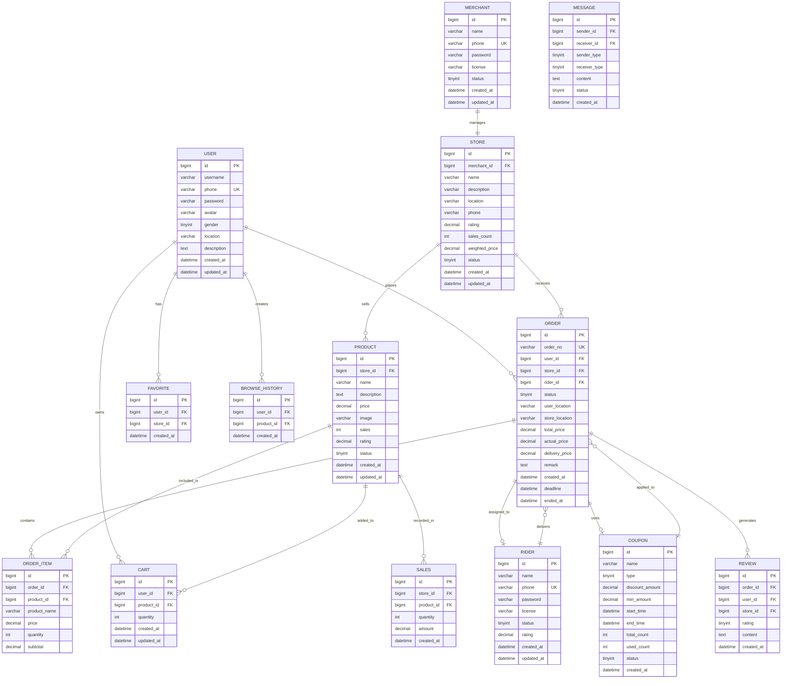
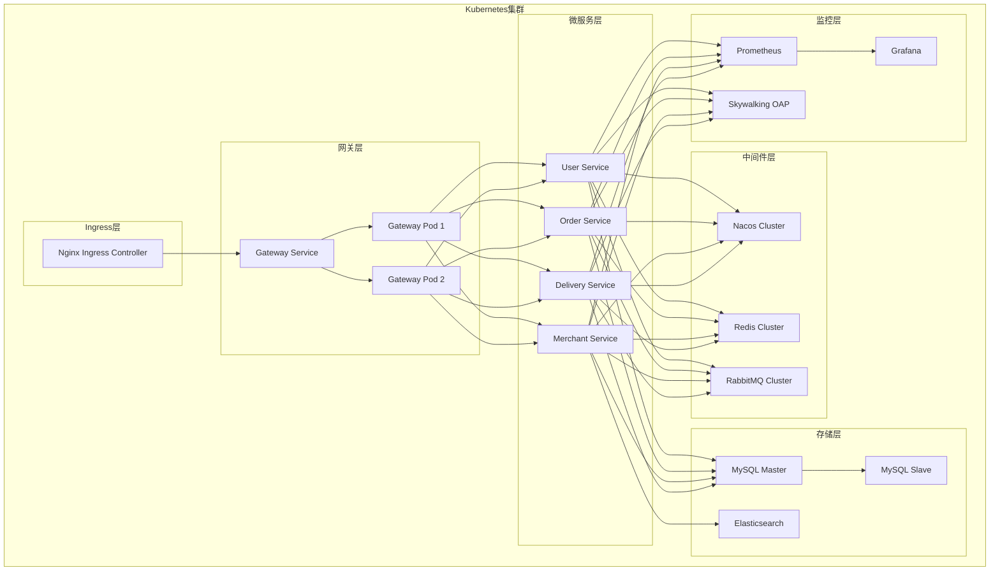

# 饱了么(Baoleme)微服务技术架构设计文档

## 文档信息
- **项目名称**: 饱了么外卖平台微服务架构
- **文档版本**: v1.0
- **创建日期**: 2024年
- **文档类型**: 技术架构设计文档

---

## 1. 架构设计

### 1.1 整体架构图


### 1.2 服务交互架构


---

## 2. 技术描述

### 2.1 技术栈选型

**前端技术栈**
- 移动端：React Native / Flutter
- Web管理后台：React 18 + Ant Design + TypeScript
- 构建工具：Vite

**后端技术栈**
- 框架：Spring Boot 3.1.5 + Spring Cloud 2022.0.4
- 服务注册发现：Nacos 2.2.3
- API网关：Spring Cloud Gateway 4.0.7
- 负载均衡：Spring Cloud LoadBalancer
- 熔断器：Resilience4j
- 分布式事务：Seata 1.7.0
- 消息队列：RabbitMQ 3.12
- 缓存：Redis 7.0 Cluster
- 数据库：MySQL 8.0
- 搜索引擎：Elasticsearch 8.9
- 链路追踪：Skywalking 9.5.0
- 监控：Prometheus + Grafana
- 日志：ELK Stack

**DevOps技术栈**
- 容器化：Docker + Kubernetes
- CI/CD：Jenkins + GitLab CI
- 镜像仓库：Harbor
- 配置管理：Nacos Config
- 服务网格：Istio (后期引入)

### 2.2 核心组件版本

| 组件 | 版本 | 说明 |
|------|------|------|
| Spring Boot | 3.1.5 | 微服务基础框架 |
| Spring Cloud | 2022.0.4 | 微服务治理框架 |
| Nacos | 2.2.3 | 服务注册发现和配置中心 |
| MySQL | 8.0 | 关系型数据库 |
| Redis | 7.0 | 缓存和会话存储 |
| RabbitMQ | 3.12 | 消息队列 |
| Elasticsearch | 8.9 | 搜索引擎 |
| Seata | 1.7.0 | 分布式事务 |
| Skywalking | 9.5.0 | 链路追踪 |
| Kubernetes | 1.28 | 容器编排 |

---

## 3. 路由定义

### 3.1 前端路由

| 路由 | 组件 | 权限 | 说明 |
|------|------|------|------|
| `/` | HomePage | 公开 | 首页，商家列表展示 |
| `/login` | LoginPage | 公开 | 用户登录页面 |
| `/register` | RegisterPage | 公开 | 用户注册页面 |
| `/profile` | ProfilePage | 用户 | 个人信息管理 |
| `/orders` | OrderListPage | 用户 | 订单历史查询 |
| `/cart` | CartPage | 用户 | 购物车管理 |
| `/store/:id` | StoreDetailPage | 公开 | 商家店铺详情 |
| `/product/:id` | ProductDetailPage | 公开 | 商品详情页面 |
| `/merchant` | MerchantDashboard | 商家 | 商家管理后台 |
| `/merchant/orders` | MerchantOrderPage | 商家 | 商家订单管理 |
| `/merchant/products` | ProductManagePage | 商家 | 商品管理 |
| `/rider` | RiderDashboard | 骑手 | 骑手工作台 |
| `/rider/orders` | RiderOrderPage | 骑手 | 配送订单管理 |
| `/admin` | AdminDashboard | 管理员 | 运营管理后台 |

### 3.2 API网关路由

| 路由规则 | 目标服务 | 负载均衡 | 说明 |
|----------|----------|----------|------|
| `/api/user/**` | user-service | Round Robin | 用户相关接口 |
| `/api/merchant/**` | merchant-service | Round Robin | 商家相关接口 |
| `/api/order/**` | order-service | Round Robin | 订单相关接口 |
| `/api/delivery/**` | delivery-service | Round Robin | 配送相关接口 |
| `/api/marketing/**` | marketing-service | Round Robin | 营销相关接口 |
| `/api/communication/**` | communication-service | Round Robin | 通信相关接口 |
| `/ws/**` | communication-service | Sticky Session | WebSocket连接 |

---

## 4. API定义

### 4.1 用户服务API

#### 用户认证相关
```
POST /api/user/register
```

**请求参数：**
| 参数名 | 类型 | 必填 | 说明 |
|--------|------|------|------|
| phone | string | 是 | 手机号 |
| password | string | 是 | 密码 |
| username | string | 是 | 用户名 |
| verifyCode | string | 是 | 验证码 |

**响应示例：**
```json
{
  "code": 200,
  "message": "注册成功",
  "data": {
    "userId": 12345,
    "username": "张三",
    "phone": "13800138000",
    "token": "eyJhbGciOiJIUzI1NiIsInR5cCI6IkpXVCJ9...",
    "refreshToken": "eyJhbGciOiJIUzI1NiIsInR5cCI6IkpXVCJ9...",
    "expiresIn": 7200
  }
}
```

```
POST /api/user/login
```

**请求参数：**
| 参数名 | 类型 | 必填 | 说明 |
|--------|------|------|------|
| phone | string | 是 | 手机号 |
| password | string | 是 | 密码 |

**响应示例：**
```json
{
  "code": 200,
  "message": "登录成功",
  "data": {
    "userId": 12345,
    "username": "张三",
    "phone": "13800138000",
    "avatar": "https://cdn.baoleme.com/avatar/12345.jpg",
    "token": "eyJhbGciOiJIUzI1NiIsInR5cCI6IkpXVCJ9...",
    "refreshToken": "eyJhbGciOiJIUzI1NiIsInR5cCI6IkpXVCJ9...",
    "expiresIn": 7200
  }
}
```

#### 用户信息管理
```
GET /api/user/profile
```

**请求头：**
| 参数名 | 类型 | 必填 | 说明 |
|--------|------|------|------|
| Authorization | string | 是 | Bearer token |

**响应示例：**
```json
{
  "code": 200,
  "message": "获取成功",
  "data": {
    "userId": 12345,
    "username": "张三",
    "phone": "13800138000",
    "avatar": "https://cdn.baoleme.com/avatar/12345.jpg",
    "gender": 1,
    "location": "北京市朝阳区",
    "description": "美食爱好者",
    "createdAt": "2024-01-01T10:00:00Z"
  }
}
```

### 4.2 订单服务API

#### 订单创建
```
POST /api/order/create
```

**请求参数：**
| 参数名 | 类型 | 必填 | 说明 |
|--------|------|------|------|
| storeId | long | 是 | 店铺ID |
| items | array | 是 | 订单商品列表 |
| userLocation | string | 是 | 用户地址 |
| remark | string | 否 | 订单备注 |
| couponId | long | 否 | 优惠券ID |

**商品项结构：**
| 参数名 | 类型 | 必填 | 说明 |
|--------|------|------|------|
| productId | long | 是 | 商品ID |
| quantity | int | 是 | 购买数量 |
| price | decimal | 是 | 商品单价 |

**请求示例：**
```json
{
  "storeId": 1001,
  "items": [
    {
      "productId": 2001,
      "quantity": 2,
      "price": 25.80
    },
    {
      "productId": 2002,
      "quantity": 1,
      "price": 18.50
    }
  ],
  "userLocation": "北京市朝阳区望京SOHO",
  "remark": "少辣，多放香菜",
  "couponId": 3001
}
```

**响应示例：**
```json
{
  "code": 200,
  "message": "订单创建成功",
  "data": {
    "orderId": 10001,
    "orderNo": "BLM202401011000001",
    "totalPrice": 70.10,
    "discountAmount": 5.00,
    "deliveryFee": 6.00,
    "actualPrice": 71.10,
    "status": 0,
    "statusText": "待支付",
    "paymentId": "PAY202401011000001",
    "createdAt": "2024-01-01T12:00:00Z",
    "deadline": "2024-01-01T12:30:00Z"
  }
}
```

### 4.3 商家服务API

#### 商品搜索
```
GET /api/merchant/products/search
```

**请求参数：**
| 参数名 | 类型 | 必填 | 说明 |
|--------|------|------|------|
| keyword | string | 否 | 搜索关键词 |
| categoryId | long | 否 | 商品分类ID |
| storeId | long | 否 | 店铺ID |
| minPrice | decimal | 否 | 最低价格 |
| maxPrice | decimal | 否 | 最高价格 |
| sortBy | string | 否 | 排序字段(price/sales/rating) |
| sortOrder | string | 否 | 排序方向(asc/desc) |
| page | int | 否 | 页码，默认1 |
| size | int | 否 | 每页大小，默认20 |

**响应示例：**
```json
{
  "code": 200,
  "message": "搜索成功",
  "data": {
    "total": 156,
    "page": 1,
    "size": 20,
    "products": [
      {
        "productId": 2001,
        "name": "宫保鸡丁",
        "description": "经典川菜，香辣可口",
        "price": 25.80,
        "originalPrice": 28.00,
        "image": "https://cdn.baoleme.com/product/2001.jpg",
        "sales": 1250,
        "rating": 4.8,
        "storeId": 1001,
        "storeName": "川味小厨",
        "categoryId": 101,
        "categoryName": "热菜"
      }
    ]
  }
}
```

### 4.4 通用响应格式

**成功响应：**
```json
{
  "code": 200,
  "message": "操作成功",
  "data": {},
  "timestamp": "2024-01-01T12:00:00Z",
  "traceId": "trace-12345"
}
```

**错误响应：**
```json
{
  "code": 400,
  "message": "参数错误",
  "error": "用户名不能为空",
  "timestamp": "2024-01-01T12:00:00Z",
  "traceId": "trace-12345"
}
```

**状态码定义：**
| 状态码 | 说明 |
|--------|------|
| 200 | 操作成功 |
| 400 | 请求参数错误 |
| 401 | 未授权访问 |
| 403 | 权限不足 |
| 404 | 资源不存在 |
| 500 | 服务器内部错误 |
| 503 | 服务不可用 |

---

## 5. 服务架构图

### 5.1 微服务内部架构


### 5.2 分层架构设计


---

## 6. 数据模型

### 6.1 数据模型定义


### 6.2 数据定义语言(DDL)

#### 用户服务数据库
```sql
-- 创建用户数据库
CREATE DATABASE baoleme_user CHARACTER SET utf8mb4 COLLATE utf8mb4_unicode_ci;

USE baoleme_user;

-- 用户表
CREATE TABLE user (
    id BIGINT PRIMARY KEY AUTO_INCREMENT COMMENT '用户ID',
    username VARCHAR(50) NOT NULL COMMENT '用户名',
    phone VARCHAR(20) NOT NULL UNIQUE COMMENT '手机号',
    password VARCHAR(255) NOT NULL COMMENT '密码哈希',
    avatar VARCHAR(500) COMMENT '头像URL',
    gender TINYINT DEFAULT 0 COMMENT '性别：0-未知，1-男，2-女',
    location VARCHAR(200) COMMENT '常用地址',
    description TEXT COMMENT '个人描述',
    created_at DATETIME DEFAULT CURRENT_TIMESTAMP COMMENT '创建时间',
    updated_at DATETIME DEFAULT CURRENT_TIMESTAMP ON UPDATE CURRENT_TIMESTAMP COMMENT '更新时间',
    INDEX idx_phone (phone),
    INDEX idx_created_at (created_at)
) ENGINE=InnoDB COMMENT='用户表';

-- 收藏表
CREATE TABLE favorite (
    id BIGINT PRIMARY KEY AUTO_INCREMENT COMMENT '收藏ID',
    user_id BIGINT NOT NULL COMMENT '用户ID',
    store_id BIGINT NOT NULL COMMENT '店铺ID',
    created_at DATETIME DEFAULT CURRENT_TIMESTAMP COMMENT '收藏时间',
    UNIQUE KEY uk_user_store (user_id, store_id),
    INDEX idx_user_id (user_id),
    INDEX idx_store_id (store_id)
) ENGINE=InnoDB COMMENT='用户收藏表';

-- 浏览历史表
CREATE TABLE browse_history (
    id BIGINT PRIMARY KEY AUTO_INCREMENT COMMENT '浏览记录ID',
    user_id BIGINT NOT NULL COMMENT '用户ID',
    product_id BIGINT NOT NULL COMMENT '商品ID',
    created_at DATETIME DEFAULT CURRENT_TIMESTAMP COMMENT '浏览时间',
    INDEX idx_user_id (user_id),
    INDEX idx_product_id (product_id),
    INDEX idx_created_at (created_at)
) ENGINE=InnoDB COMMENT='浏览历史表';

-- 购物车表
CREATE TABLE cart (
    id BIGINT PRIMARY KEY AUTO_INCREMENT COMMENT '购物车ID',
    user_id BIGINT NOT NULL COMMENT '用户ID',
    product_id BIGINT NOT NULL COMMENT '商品ID',
    quantity INT NOT NULL DEFAULT 1 COMMENT '商品数量',
    created_at DATETIME DEFAULT CURRENT_TIMESTAMP COMMENT '添加时间',
    updated_at DATETIME DEFAULT CURRENT_TIMESTAMP ON UPDATE CURRENT_TIMESTAMP COMMENT '更新时间',
    UNIQUE KEY uk_user_product (user_id, product_id),
    INDEX idx_user_id (user_id)
) ENGINE=InnoDB COMMENT='购物车表';

-- 初始化数据
INSERT INTO user (username, phone, password, gender, location) VALUES
('张三', '13800138001', '$2a$10$N.zmdr9k7uOCQb376NoUnuTJ8iAt6Z5EHsM8lE9lBaLO.GfaAUKyG', 1, '北京市朝阳区'),
('李四', '13800138002', '$2a$10$N.zmdr9k7uOCQb376NoUnuTJ8iAt6Z5EHsM8lE9lBaLO.GfaAUKyG', 2, '上海市浦东新区'),
('王五', '13800138003', '$2a$10$N.zmdr9k7uOCQb376NoUnuTJ8iAt6Z5EHsM8lE9lBaLO.GfaAUKyG', 1, '广州市天河区');
```

#### 订单服务数据库
```sql
-- 创建订单数据库
CREATE DATABASE baoleme_order CHARACTER SET utf8mb4 COLLATE utf8mb4_unicode_ci;

USE baoleme_order;

-- 订单表
CREATE TABLE `order` (
    id BIGINT PRIMARY KEY AUTO_INCREMENT COMMENT '订单ID',
    order_no VARCHAR(32) NOT NULL UNIQUE COMMENT '订单号',
    user_id BIGINT NOT NULL COMMENT '用户ID',
    store_id BIGINT NOT NULL COMMENT '店铺ID',
    rider_id BIGINT COMMENT '骑手ID',
    status TINYINT NOT NULL DEFAULT 0 COMMENT '订单状态：0-待支付，1-待接单，2-制作中，3-待取餐，4-配送中，5-已完成，6-已取消',
    user_location VARCHAR(500) NOT NULL COMMENT '用户地址',
    store_location VARCHAR(500) COMMENT '店铺地址',
    total_price DECIMAL(10,2) NOT NULL COMMENT '商品总价',
    actual_price DECIMAL(10,2) NOT NULL COMMENT '实际支付金额',
    delivery_price DECIMAL(10,2) NOT NULL DEFAULT 0 COMMENT '配送费',
    discount_amount DECIMAL(10,2) DEFAULT 0 COMMENT '优惠金额',
    remark TEXT COMMENT '订单备注',
    created_at DATETIME DEFAULT CURRENT_TIMESTAMP COMMENT '创建时间',
    deadline DATETIME COMMENT '订单截止时间',
    ended_at DATETIME COMMENT '完成时间',
    INDEX idx_user_id (user_id),
    INDEX idx_store_id (store_id),
    INDEX idx_rider_id (rider_id),
    INDEX idx_status (status),
    INDEX idx_created_at (created_at)
) ENGINE=InnoDB COMMENT='订单表';

-- 订单明细表
CREATE TABLE order_item (
    id BIGINT PRIMARY KEY AUTO_INCREMENT COMMENT '订单明细ID',
    order_id BIGINT NOT NULL COMMENT '订单ID',
    product_id BIGINT NOT NULL COMMENT '商品ID',
    product_name VARCHAR(200) NOT NULL COMMENT '商品名称',
    price DECIMAL(10,2) NOT NULL COMMENT '商品单价',
    quantity INT NOT NULL COMMENT '购买数量',
    subtotal DECIMAL(10,2) NOT NULL COMMENT '小计金额',
    INDEX idx_order_id (order_id),
    INDEX idx_product_id (product_id)
) ENGINE=InnoDB COMMENT='订单明细表';

-- 订单状态变更触发器
DELIMITER $$
CREATE TRIGGER order_status_update_trigger
AFTER UPDATE ON `order`
FOR EACH ROW
BEGIN
    -- 订单完成时更新结束时间
    IF NEW.status = 5 AND OLD.status != 5 THEN
        UPDATE `order` SET ended_at = NOW() WHERE id = NEW.id;
        
        -- 插入销售记录
        INSERT INTO baoleme_marketing.sales (store_id, product_id, quantity, amount, created_at)
        SELECT NEW.store_id, oi.product_id, oi.quantity, oi.subtotal, NOW()
        FROM order_item oi WHERE oi.order_id = NEW.id;
    END IF;
END$$
DELIMITER ;
```

#### Redis缓存设计
```
缓存键设计规范：

用户相关：
- user:info:{userId}                    # 用户基本信息，TTL: 1小时
- user:token:{token}                    # 用户登录token，TTL: 2小时
- user:login:attempts:{phone}           # 登录尝试次数，TTL: 15分钟

商家相关：
- store:info:{storeId}                  # 店铺信息，TTL: 30分钟
- store:products:{storeId}              # 店铺商品列表，TTL: 10分钟
- product:info:{productId}              # 商品详情，TTL: 30分钟

订单相关：
- order:info:{orderId}                  # 订单详情，TTL: 1小时
- order:status:{orderId}                # 订单状态，TTL: 30分钟
- user:orders:{userId}                  # 用户订单列表，TTL: 10分钟

购物车：
- cart:{userId}                         # 用户购物车，TTL: 7天

限流相关：
- rate_limit:api:{userId}:{endpoint}    # API限流，TTL: 1分钟
- rate_limit:login:{ip}                 # 登录限流，TTL: 1小时

分布式锁：
- lock:order:create:{userId}            # 订单创建锁，TTL: 30秒
- lock:stock:reduce:{productId}         # 库存扣减锁，TTL: 10秒
```

---

## 7. 部署架构

### 7.1 Kubernetes部署架构


### 7.2 服务部署配置

#### 用户服务部署配置
```yaml
apiVersion: apps/v1
kind: Deployment
metadata:
  name: user-service
  namespace: baoleme
  labels:
    app: user-service
    version: v1
spec:
  replicas: 3
  selector:
    matchLabels:
      app: user-service
  template:
    metadata:
      labels:
        app: user-service
        version: v1
    spec:
      containers:
      - name: user-service
        image: baoleme/user-service:1.0.0
        ports:
        - containerPort: 8080
        env:
        - name: SPRING_PROFILES_ACTIVE
          value: "prod"
        - name: NACOS_SERVER_ADDR
          value: "nacos-service:8848"
        - name: MYSQL_HOST
          value: "mysql-user-service"
        - name: REDIS_HOST
          value: "redis-cluster-service"
        resources:
          requests:
            memory: "512Mi"
            cpu: "250m"
          limits:
            memory: "1Gi"
            cpu: "500m"
        livenessProbe:
          httpGet:
            path: /actuator/health
            port: 8080
          initialDelaySeconds: 60
          periodSeconds: 30
        readinessProbe:
          httpGet:
            path: /actuator/health
            port: 8080
          initialDelaySeconds: 30
          periodSeconds: 10
        volumeMounts:
        - name: config-volume
          mountPath: /app/config
      volumes:
      - name: config-volume
        configMap:
          name: user-service-config
---
apiVersion: v1
kind: Service
metadata:
  name: user-service
  namespace: baoleme
spec:
  selector:
    app: user-service
  ports:
  - protocol: TCP
    port: 8080
    targetPort: 8080
  type: ClusterIP
```

#### ConfigMap配置
```yaml
apiVersion: v1
kind: ConfigMap
metadata:
  name: user-service-config
  namespace: baoleme
data:
  application-prod.yml: |
    server:
      port: 8080
    spring:
      application:
        name: user-service
      datasource:
        url: jdbc:mysql://${MYSQL_HOST}:3306/baoleme_user?useUnicode=true&characterEncoding=utf8&useSSL=false&serverTimezone=Asia/Shanghai
        username: ${MYSQL_USERNAME}
        password: ${MYSQL_PASSWORD}
        driver-class-name: com.mysql.cj.jdbc.Driver
      redis:
        host: ${REDIS_HOST}
        port: 6379
        password: ${REDIS_PASSWORD}
        database: 0
        lettuce:
          pool:
            max-active: 20
            max-idle: 10
            min-idle: 5
      cloud:
        nacos:
          discovery:
            server-addr: ${NACOS_SERVER_ADDR}
            namespace: baoleme-prod
            group: DEFAULT_GROUP
          config:
            server-addr: ${NACOS_SERVER_ADDR}
            namespace: baoleme-prod
            group: DEFAULT_GROUP
            file-extension: yml
    management:
      endpoints:
        web:
          exposure:
            include: health,info,metrics,prometheus
      endpoint:
        health:
          show-details: always
    logging:
      level:
        com.baoleme: DEBUG
        org.springframework.cloud: INFO
      pattern:
        console: "%d{yyyy-MM-dd HH:mm:ss} [%thread] %-5level [%X{traceId}] %logger{36} - %msg%n"
```

---

**文档完成**

本技术架构设计文档详细描述了饱了么微服务化重构的技术实现方案，包括：

1. **完整的架构设计**：从整体架构到服务内部架构的全面设计
2. **详细的技术选型**：明确的技术栈和版本选择
3. **清晰的API定义**：标准化的接口设计和文档
4. **完善的数据模型**：数据库设计和缓存策略
5. **可执行的部署方案**：Kubernetes部署配置和运维方案

该文档为微服务化重构提供了完整的技术指导，确保项目能够按照标准化的方式进行实施。